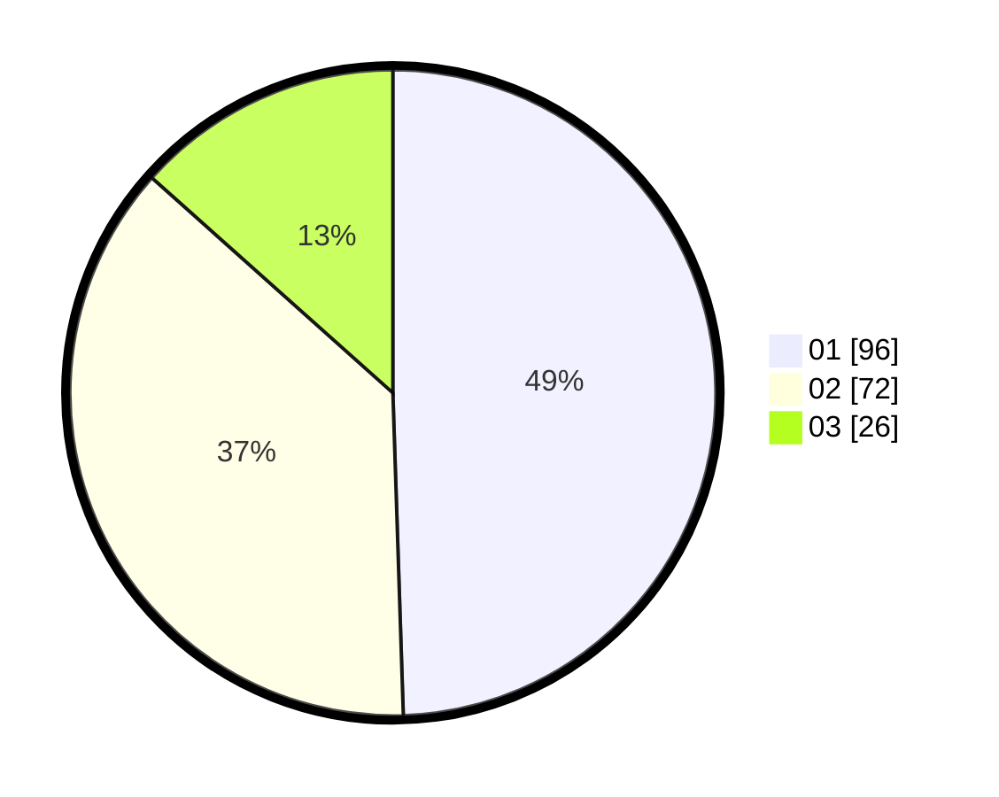

# Hasil

Hasil perolehan suara paslon dapat dilihat pada file paslon-01.txt, paslon-02.txt, dan paslon-03.txt.

Jika tidak ada, artinya data tersebut belum ada pada SIREKAP.

## Perolehan Suara

 * Paslon 01: **96**.
 * Paslon 02: **72**.
 * Paslon 03: **26**.

## Foto C Plano

https://sirekap-obj-formc.kpu.go.id/1f21/pemilu/ppwp/31/74/07/10/09/3174071009007-20240217-111052--d89a94d9-1b78-46d5-abb4-f1e9839e457f.jpg

https://sirekap-obj-formc.kpu.go.id/1f21/pemilu/ppwp/31/74/07/10/09/3174071009007-20240217-111118--e10b4864-8442-440a-b68f-52e7dbbbee6a.jpg

https://sirekap-obj-formc.kpu.go.id/1f21/pemilu/ppwp/31/74/07/10/09/3174071009007-20240217-111130--280b092a-ec24-4eb0-8080-d645eec8f777.jpg

## DATA PEMILIH TETAP

Jumlah pemilih dalam DPT: **249**.
 * L: **96**.
 * P: **23**.

## DATA PENGGUNA HAK PILIH

Jumlah pengguna hak pilih dalam DPT: **83**.
 * L: **803**.
 * P: **6**.

Jumlah pengguna hak pilih dalam DPTb: **880**.
 * L: **882**.
 * P: **885**.

Jumlah pengguna hak pilih dalam DPK: **884**.
 * L: **883**.
 * P: **884**.

Jumlah pengguna hak pilih: **494**.
 * L: **882**.
 * P: **462**.

## JUMLAH SUARA SAH DAN TIDAK SAH

JUMLAH SELURUH SUARA SAH: **194**.

JUMLAH SUARA TIDAK SAH: **0**.

JUMLAH SELURUH SUARA SAH DAN SUARA TIDAK SAH: **194**.
