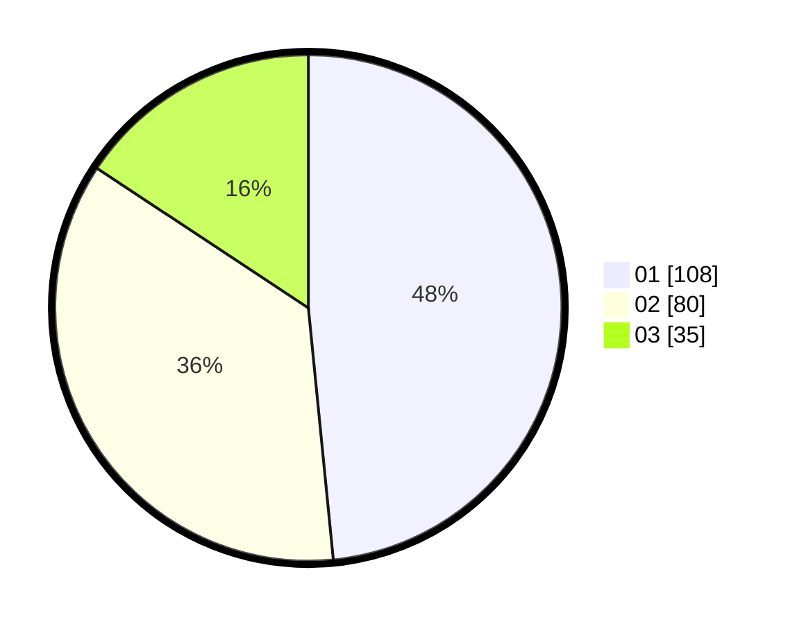

# Hasil

Hasil perolehan suara paslon dapat dilihat pada file paslon-01.txt, paslon-02.txt, dan paslon-03.txt.

Jika tidak ada, artinya data tersebut belum ada pada SIREKAP.

## Perolehan Suara

 * Paslon 01: **108**.
 * Paslon 02: **80**.
 * Paslon 03: **35**.

## Foto C Plano

https://sirekap-obj-formc.kpu.go.id/35b8/pemilu/ppwp/31/74/07/10/09/3174071009008-20240217-114227--61208fe4-b1f1-4d00-87b2-6bbb7afe5825.jpg

https://sirekap-obj-formc.kpu.go.id/35b8/pemilu/ppwp/31/74/07/10/09/3174071009008-20240217-114523--ccabdaa7-7a21-4de9-918b-6eaeb0218709.jpg

https://sirekap-obj-formc.kpu.go.id/35b8/pemilu/ppwp/31/74/07/10/09/3174071009008-20240217-114537--36578abd-d771-49e5-8efe-4e0c61fe030a.jpg

## DATA PEMILIH TETAP

Jumlah pemilih dalam DPT: **268**.
 * L: **829**.
 * P: **39**.

## DATA PENGGUNA HAK PILIH

Jumlah pengguna hak pilih dalam DPT: **228**.
 * L: **98**.
 * P: **820**.

Jumlah pengguna hak pilih dalam DPTb: **888**.
 * L: **2**.
 * P: **886**.

Jumlah pengguna hak pilih dalam DPK: **808**.
 * L: **888**.
 * P: **88**.

Jumlah pengguna hak pilih: **225**.
 * L: **99**.
 * P: **26**.

## JUMLAH SUARA SAH DAN TIDAK SAH

JUMLAH SELURUH SUARA SAH: **223**.

JUMLAH SUARA TIDAK SAH: **2**.

JUMLAH SELURUH SUARA SAH DAN SUARA TIDAK SAH: **225**.
