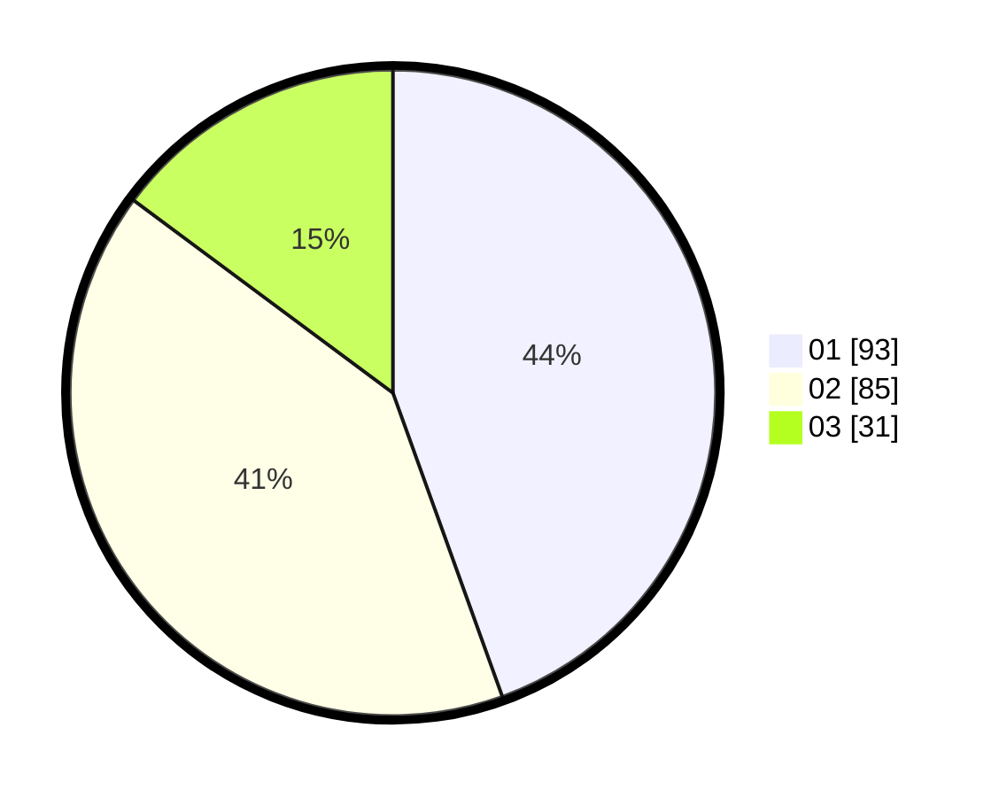

# Hasil

Hasil perolehan suara paslon dapat dilihat pada file paslon-01.txt, paslon-02.txt, dan paslon-03.txt.

Jika tidak ada, artinya data tersebut belum ada pada SIREKAP.

## Perolehan Suara

 * Paslon 01: **93**.
 * Paslon 02: **85**.
 * Paslon 03: **31**.

## Foto C Plano

https://sirekap-obj-formc.kpu.go.id/e991/pemilu/ppwp/31/74/07/10/09/3174071009009-20240217-122250--7a52571b-7858-4148-a9fe-5e7b42db17ce.jpg

https://sirekap-obj-formc.kpu.go.id/e991/pemilu/ppwp/31/74/07/10/09/3174071009009-20240217-122317--367d60ed-5e41-43cf-82b4-472cb32af2dd.jpg

https://sirekap-obj-formc.kpu.go.id/e991/pemilu/ppwp/31/74/07/10/09/3174071009009-20240217-122333--f67d5da0-becf-4c58-bf22-17985e7e778a.jpg

## DATA PEMILIH TETAP

Jumlah pemilih dalam DPT: **222**.
 * L: **634**.
 * P: **544**.

## DATA PENGGUNA HAK PILIH

Jumlah pengguna hak pilih dalam DPT: **55**.
 * L: **858**.
 * P: **455**.

Jumlah pengguna hak pilih dalam DPTb: **842**.
 * L: **889**.
 * P: **884**.

Jumlah pengguna hak pilih dalam DPK: **880**.
 * L: **880**.
 * P: **888**.

Jumlah pengguna hak pilih: **280**.
 * L: **890**.
 * P: **43**.

## JUMLAH SUARA SAH DAN TIDAK SAH

JUMLAH SELURUH SUARA SAH: **209**.

JUMLAH SUARA TIDAK SAH: **1**.

JUMLAH SELURUH SUARA SAH DAN SUARA TIDAK SAH: **210**.
