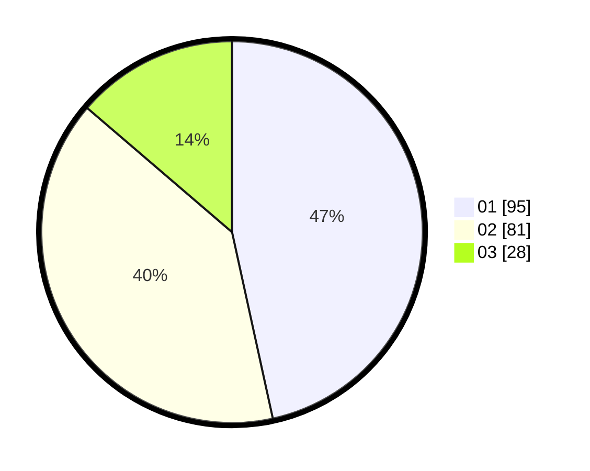

# Hasil

Hasil perolehan suara paslon dapat dilihat pada file paslon-01.txt, paslon-02.txt, dan paslon-03.txt.

Jika tidak ada, artinya data tersebut belum ada pada SIREKAP.

## Perolehan Suara

 * Paslon 01: **95**.
 * Paslon 02: **81**.
 * Paslon 03: **28**.

## Foto C Plano

https://sirekap-obj-formc.kpu.go.id/e4a8/pemilu/ppwp/31/74/07/10/09/3174071009014-20240217-161912--01d47885-c550-4371-9cc0-a1aafdff1f9a.jpg

https://sirekap-obj-formc.kpu.go.id/e4a8/pemilu/ppwp/31/74/07/10/09/3174071009014-20240217-161924--b5457f02-5f2d-4f8e-886b-ac680c4a2a52.jpg

https://sirekap-obj-formc.kpu.go.id/e4a8/pemilu/ppwp/31/74/07/10/09/3174071009014-20240217-161937--b7d4f76f-13a1-4d33-8227-5334bcfc5669.jpg

## DATA PEMILIH TETAP

Jumlah pemilih dalam DPT: **249**.
 * L: **448**.
 * P: **522**.

## DATA PENGGUNA HAK PILIH

Jumlah pengguna hak pilih dalam DPT: **492**.
 * L: **860**.
 * P: **0**.

Jumlah pengguna hak pilih dalam DPTb: **880**.
 * L: **884**.
 * P: **883**.

Jumlah pengguna hak pilih dalam DPK: **886**.
 * L: **884**.
 * P: **882**.

Jumlah pengguna hak pilih: **205**.
 * L: **899**.
 * P: **406**.

## JUMLAH SUARA SAH DAN TIDAK SAH

JUMLAH SELURUH SUARA SAH: **204**.

JUMLAH SUARA TIDAK SAH: **1**.

JUMLAH SELURUH SUARA SAH DAN SUARA TIDAK SAH: **205**.
