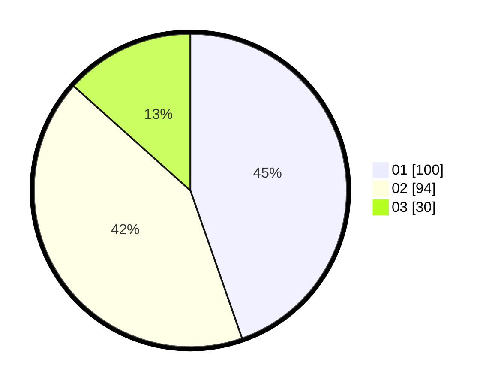

# Hasil

Hasil perolehan suara paslon dapat dilihat pada file paslon-01.txt, paslon-02.txt, dan paslon-03.txt.

Jika tidak ada, artinya data tersebut belum ada pada SIREKAP.

## Perolehan Suara

 * Paslon 01: **100**.
 * Paslon 02: **94**.
 * Paslon 03: **30**.

## Foto C Plano

https://sirekap-obj-formc.kpu.go.id/6576/pemilu/ppwp/31/74/07/10/09/3174071009016-20240214-214033--37c73e68-8397-4663-a5e9-18105525f13d.jpg

https://sirekap-obj-formc.kpu.go.id/6576/pemilu/ppwp/31/74/07/10/09/3174071009016-20240214-214115--19838109-462c-4c32-acd0-a36c04e30dd9.jpg

https://sirekap-obj-formc.kpu.go.id/6576/pemilu/ppwp/31/74/07/10/09/3174071009016-20240214-214152--c91b5811-f8d3-42a4-86e1-44fc59e8d290.jpg

## DATA PEMILIH TETAP

Jumlah pemilih dalam DPT: **258**.
 * L: **137**.
 * P: **121**.

## DATA PENGGUNA HAK PILIH

Jumlah pengguna hak pilih dalam DPT: **218**.
 * L: **113**.
 * P: **105**.

Jumlah pengguna hak pilih dalam DPTb: **7**.
 * L: **7**.
 * P: **0**.

Jumlah pengguna hak pilih dalam DPK: **0**.
 * L: **0**.
 * P: **0**.

Jumlah pengguna hak pilih: **225**.
 * L: **120**.
 * P: **105**.

## JUMLAH SUARA SAH DAN TIDAK SAH

JUMLAH SELURUH SUARA SAH: **224**.

JUMLAH SUARA TIDAK SAH: **1**.

JUMLAH SELURUH SUARA SAH DAN SUARA TIDAK SAH: **225**.
