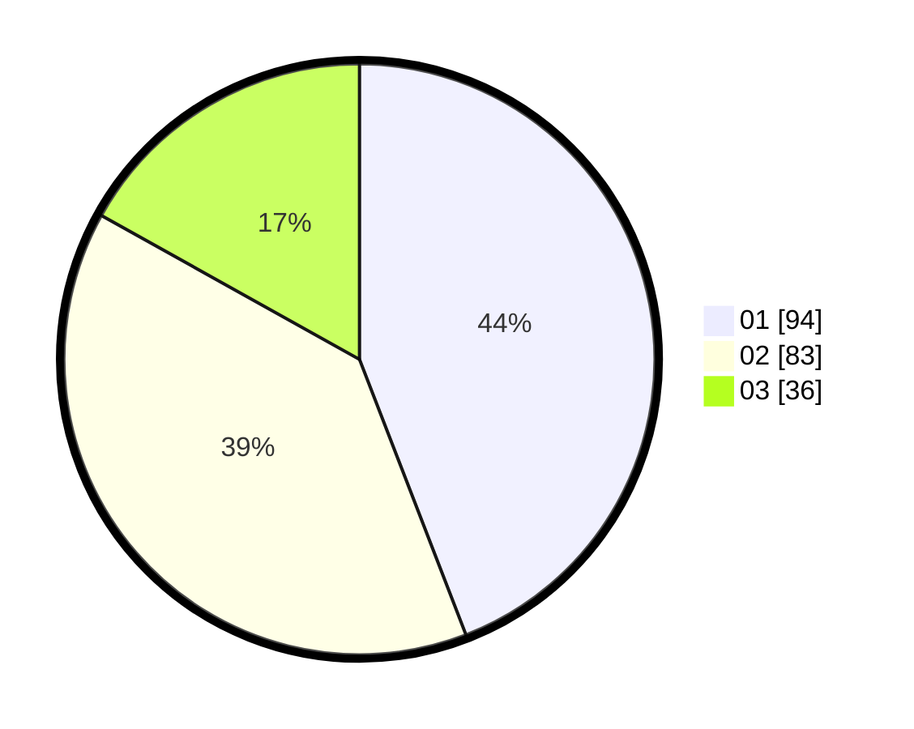

# Hasil

Hasil perolehan suara paslon dapat dilihat pada file paslon-01.txt, paslon-02.txt, dan paslon-03.txt.

Jika tidak ada, artinya data tersebut belum ada pada SIREKAP.

## Perolehan Suara

 * Paslon 01: **94**.
 * Paslon 02: **83**.
 * Paslon 03: **36**.

## Foto C Plano

https://sirekap-obj-formc.kpu.go.id/ce5c/pemilu/ppwp/31/74/07/10/09/3174071009017-20240218-104514--34cc5b69-c011-4bde-99bc-237c7041973b.jpg

https://sirekap-obj-formc.kpu.go.id/ce5c/pemilu/ppwp/31/74/07/10/09/3174071009017-20240218-104529--05f01c73-da0d-47bf-8bbc-0845292f743c.jpg

https://sirekap-obj-formc.kpu.go.id/ce5c/pemilu/ppwp/31/74/07/10/09/3174071009017-20240218-104543--f6a3b067-07ef-428f-954a-3909f0a7bded.jpg

## DATA PEMILIH TETAP

Jumlah pemilih dalam DPT: **258**.
 * L: **20**.
 * P: **36**.

## DATA PENGGUNA HAK PILIH

Jumlah pengguna hak pilih dalam DPT: **204**.
 * L: **822**.
 * P: **2**.

Jumlah pengguna hak pilih dalam DPTb: **806**.
 * L: **883**.
 * P: **883**.

Jumlah pengguna hak pilih dalam DPK: **888**.
 * L: **888**.
 * P: **880**.

Jumlah pengguna hak pilih: **245**.
 * L: **899**.
 * P: **26**.

## JUMLAH SUARA SAH DAN TIDAK SAH

JUMLAH SELURUH SUARA SAH: **213**.

JUMLAH SUARA TIDAK SAH: **2**.

JUMLAH SELURUH SUARA SAH DAN SUARA TIDAK SAH: **215**.
