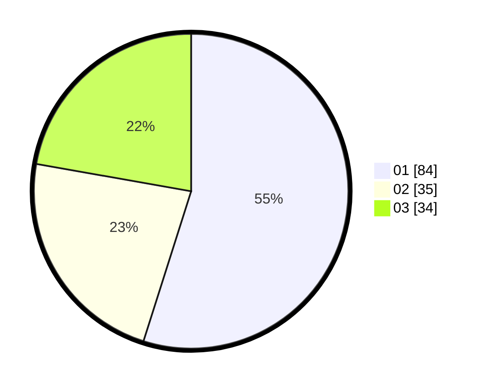

# Hasil

Hasil perolehan suara paslon dapat dilihat pada file paslon-01.txt, paslon-02.txt, dan paslon-03.txt.

Jika tidak ada, artinya data tersebut belum ada pada SIREKAP.

## Perolehan Suara

 * Paslon 01: **84**.
 * Paslon 02: **35**.
 * Paslon 03: **34**.

## Foto C Plano

https://sirekap-obj-formc.kpu.go.id/c1fb/pemilu/ppwp/31/74/07/10/09/3174071009018-20240218-112103--504fe42b-b2d8-4bf1-8a28-2188a4abc753.jpg

https://sirekap-obj-formc.kpu.go.id/c1fb/pemilu/ppwp/31/74/07/10/09/3174071009018-20240218-112147--517fcf2c-873f-492a-849b-e1e3c88be499.jpg

https://sirekap-obj-formc.kpu.go.id/c1fb/pemilu/ppwp/31/74/07/10/09/3174071009018-20240218-112136--745800a6-3b04-4589-9974-addd471f12cb.jpg

## DATA PEMILIH TETAP

Jumlah pemilih dalam DPT: **46**.
 * L: **865**.
 * P: **876**.

## DATA PENGGUNA HAK PILIH

Jumlah pengguna hak pilih dalam DPT: **899**.
 * L: **54**.
 * P: **826**.

Jumlah pengguna hak pilih dalam DPTb: **888**.
 * L: **883**.
 * P: **885**.

Jumlah pengguna hak pilih dalam DPK: **885**.
 * L: **882**.
 * P: **883**.

Jumlah pengguna hak pilih: **893**.
 * L: **849**.
 * P: **854**.

## JUMLAH SUARA SAH DAN TIDAK SAH

JUMLAH SELURUH SUARA SAH: **803**.

JUMLAH SUARA TIDAK SAH: **888**.

JUMLAH SELURUH SUARA SAH DAN SUARA TIDAK SAH: **203**.
