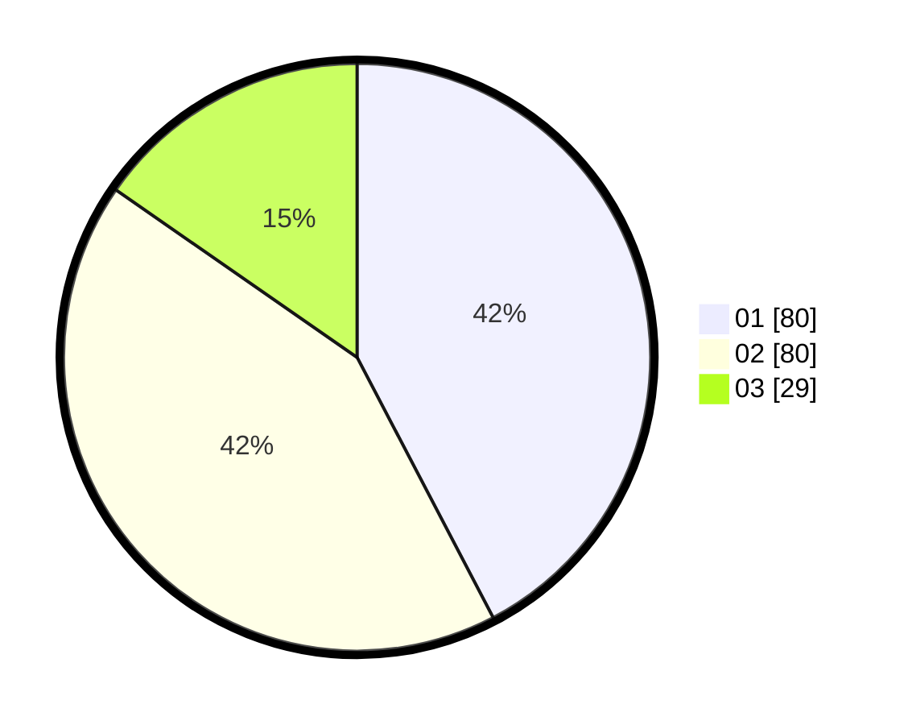

# Hasil

Hasil perolehan suara paslon dapat dilihat pada file paslon-01.txt, paslon-02.txt, dan paslon-03.txt.

Jika tidak ada, artinya data tersebut belum ada pada SIREKAP.

## Perolehan Suara

 * Paslon 01: **80**.
 * Paslon 02: **80**.
 * Paslon 03: **29**.

## Foto C Plano

https://sirekap-obj-formc.kpu.go.id/4471/pemilu/ppwp/31/74/07/10/09/3174071009026-20240218-190513--84d288c9-c25e-4442-9714-753061f64704.jpg

https://sirekap-obj-formc.kpu.go.id/4471/pemilu/ppwp/31/74/07/10/09/3174071009026-20240218-190530--7a15627c-d2e2-4a1d-8ab2-eb24f55e3d85.jpg

https://sirekap-obj-formc.kpu.go.id/4471/pemilu/ppwp/31/74/07/10/09/3174071009026-20240218-190611--f7969d8d-5b39-4b12-b1fe-e704a0eaa3ba.jpg

## DATA PEMILIH TETAP

Jumlah pemilih dalam DPT: **298**.
 * L: **808**.
 * P: **235**.

## DATA PENGGUNA HAK PILIH

Jumlah pengguna hak pilih dalam DPT: **82**.
 * L: **878**.
 * P: **229**.

Jumlah pengguna hak pilih dalam DPTb: **820**.
 * L: **887**.
 * P: **883**.

Jumlah pengguna hak pilih dalam DPK: **888**.
 * L: **888**.
 * P: **888**.

Jumlah pengguna hak pilih: **893**.
 * L: **888**.
 * P: **888**.

## JUMLAH SUARA SAH DAN TIDAK SAH

JUMLAH SELURUH SUARA SAH: **189**.

JUMLAH SUARA TIDAK SAH: **2**.

JUMLAH SELURUH SUARA SAH DAN SUARA TIDAK SAH: **191**.
