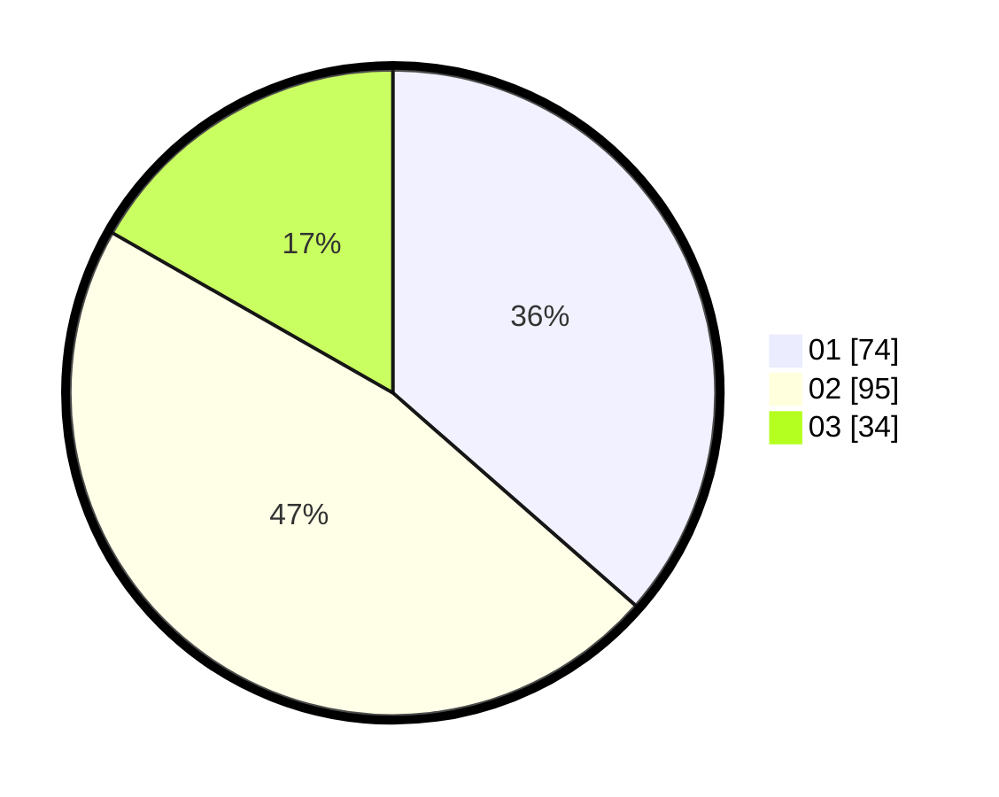

# Hasil

Hasil perolehan suara paslon dapat dilihat pada file paslon-01.txt, paslon-02.txt, dan paslon-03.txt.

Jika tidak ada, artinya data tersebut belum ada pada SIREKAP.

## Perolehan Suara

 * Paslon 01: **74**.
 * Paslon 02: **95**.
 * Paslon 03: **34**.

## Foto C Plano

https://sirekap-obj-formc.kpu.go.id/9fbd/pemilu/ppwp/31/74/07/10/09/3174071009028-20240218-194141--309e7515-0811-426b-ad81-acf6901c495c.jpg

https://sirekap-obj-formc.kpu.go.id/9fbd/pemilu/ppwp/31/74/07/10/09/3174071009028-20240218-194209--4600fa73-05d1-4b89-b5ec-6ad8d271d261.jpg

https://sirekap-obj-formc.kpu.go.id/9fbd/pemilu/ppwp/31/74/07/10/09/3174071009028-20240218-194234--e6a86c00-be33-4ffc-b57d-9f4e95c0c308.jpg

## DATA PEMILIH TETAP

Jumlah pemilih dalam DPT: **224**.
 * L: **842**.
 * P: **33**.

## DATA PENGGUNA HAK PILIH

Jumlah pengguna hak pilih dalam DPT: **223**.
 * L: **22**.
 * P: **893**.

Jumlah pengguna hak pilih dalam DPTb: **853**.
 * L: **848**.
 * P: **858**.

Jumlah pengguna hak pilih dalam DPK: **552**.
 * L: **88**.
 * P: **882**.

Jumlah pengguna hak pilih: **228**.
 * L: **809**.
 * P: **899**.

## JUMLAH SUARA SAH DAN TIDAK SAH

JUMLAH SELURUH SUARA SAH: **203**.

JUMLAH SUARA TIDAK SAH: **5**.

JUMLAH SELURUH SUARA SAH DAN SUARA TIDAK SAH: **208**.
