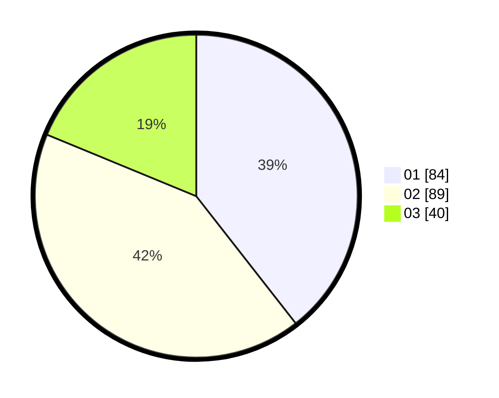

# Hasil

Hasil perolehan suara paslon dapat dilihat pada file paslon-01.txt, paslon-02.txt, dan paslon-03.txt.

Jika tidak ada, artinya data tersebut belum ada pada SIREKAP.

## Perolehan Suara

 * Paslon 01: **84**.
 * Paslon 02: **89**.
 * Paslon 03: **40**.

## Foto C Plano

https://sirekap-obj-formc.kpu.go.id/d40b/pemilu/ppwp/31/74/07/10/09/3174071009032-20240219-144041--4ac60c07-d246-4e78-a266-838a64f58c44.jpg

https://sirekap-obj-formc.kpu.go.id/d40b/pemilu/ppwp/31/74/07/10/09/3174071009032-20240219-144103--c32c4500-2904-404d-bdb8-9edfa52c5f25.jpg

https://sirekap-obj-formc.kpu.go.id/d40b/pemilu/ppwp/31/74/07/10/09/3174071009032-20240219-144125--471a9d94-16e4-42da-a511-22c208b44af1.jpg

## DATA PEMILIH TETAP

Jumlah pemilih dalam DPT: **252**.
 * L: **894**.
 * P: **453**.

## DATA PENGGUNA HAK PILIH

Jumlah pengguna hak pilih dalam DPT: **248**.
 * L: **884**.
 * P: **455**.

Jumlah pengguna hak pilih dalam DPTb: **884**.
 * L: **889**.
 * P: **888**.

Jumlah pengguna hak pilih dalam DPK: **888**.
 * L: **883**.
 * P: **883**.

Jumlah pengguna hak pilih: **339**.
 * L: **899**.
 * P: **235**.

## JUMLAH SUARA SAH DAN TIDAK SAH

JUMLAH SELURUH SUARA SAH: **258**.

JUMLAH SUARA TIDAK SAH: **827**.

JUMLAH SELURUH SUARA SAH DAN SUARA TIDAK SAH: **249**.
