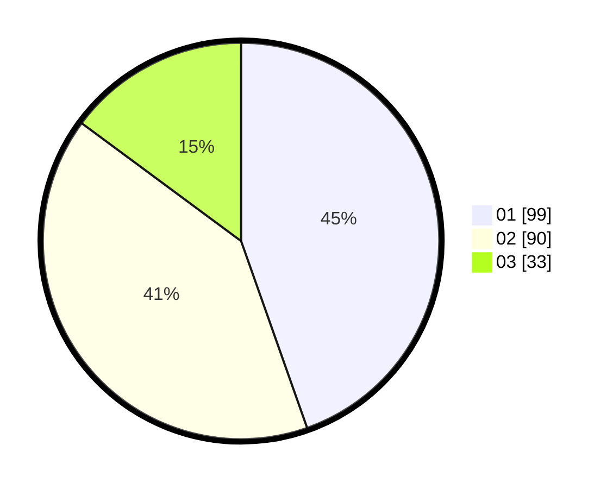

# Hasil

Hasil perolehan suara paslon dapat dilihat pada file paslon-01.txt, paslon-02.txt, dan paslon-03.txt.

Jika tidak ada, artinya data tersebut belum ada pada SIREKAP.

## Perolehan Suara

 * Paslon 01: **99**.
 * Paslon 02: **90**.
 * Paslon 03: **33**.

## Foto C Plano

https://sirekap-obj-formc.kpu.go.id/350c/pemilu/ppwp/31/74/07/10/09/3174071009036-20240219-162449--867e1351-1e4d-4db6-a345-36c661c68e18.jpg

https://sirekap-obj-formc.kpu.go.id/350c/pemilu/ppwp/31/74/07/10/09/3174071009036-20240219-162504--58f147ff-cc01-4e30-8051-112e6cce7465.jpg

https://sirekap-obj-formc.kpu.go.id/350c/pemilu/ppwp/31/74/07/10/09/3174071009036-20240219-162533--0e66c69a-f317-4d9f-9ad9-30e88dde67dc.jpg

## DATA PEMILIH TETAP

Jumlah pemilih dalam DPT: **285**.
 * L: **43**.
 * P: **239**.

## DATA PENGGUNA HAK PILIH

Jumlah pengguna hak pilih dalam DPT: **248**.
 * L: **2**.
 * P: **440**.

Jumlah pengguna hak pilih dalam DPTb: **888**.
 * L: **885**.
 * P: **884**.

Jumlah pengguna hak pilih dalam DPK: **888**.
 * L: **888**.
 * P: **888**.

Jumlah pengguna hak pilih: **234**.
 * L: **448**.
 * P: **622**.

## JUMLAH SUARA SAH DAN TIDAK SAH

JUMLAH SELURUH SUARA SAH: **222**.

JUMLAH SUARA TIDAK SAH: **82**.

JUMLAH SELURUH SUARA SAH DAN SUARA TIDAK SAH: **224**.
