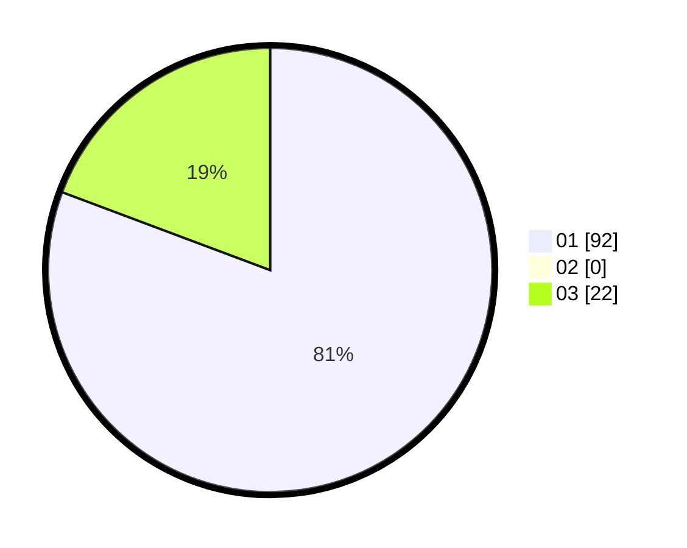

# Hasil

Hasil perolehan suara paslon dapat dilihat pada file paslon-01.txt, paslon-02.txt, dan paslon-03.txt.

Jika tidak ada, artinya data tersebut belum ada pada SIREKAP.

## Perolehan Suara

 * Paslon 01: **92**.
 * Paslon 02: **0**.
 * Paslon 03: **22**.

## Foto C Plano

https://sirekap-obj-formc.kpu.go.id/fc2b/pemilu/ppwp/31/74/07/10/09/3174071009037-20240219-175118--9fff1855-9058-42a7-a64e-7abad672e57c.jpg

https://sirekap-obj-formc.kpu.go.id/fc2b/pemilu/ppwp/31/74/07/10/09/3174071009037-20240219-175053--4bddf97c-fa70-445c-99dc-27c7645f7a03.jpg

https://sirekap-obj-formc.kpu.go.id/fc2b/pemilu/ppwp/31/74/07/10/09/3174071009037-20240219-175033--22d27198-57e2-4763-a601-c98e2acd082d.jpg

## DATA PEMILIH TETAP

Jumlah pemilih dalam DPT: **226**.
 * L: **644**.
 * P: **32**.

## DATA PENGGUNA HAK PILIH

Jumlah pengguna hak pilih dalam DPT: **283**.
 * L: **564**.
 * P: **804**.

Jumlah pengguna hak pilih dalam DPTb: **880**.
 * L: **882**.
 * P: **889**.

Jumlah pengguna hak pilih dalam DPK: **883**.
 * L: **4**.
 * P: **882**.

Jumlah pengguna hak pilih: **226**.
 * L: **580**.
 * P: **485**.

## JUMLAH SUARA SAH DAN TIDAK SAH

JUMLAH SELURUH SUARA SAH: **224**.

JUMLAH SUARA TIDAK SAH: **802**.

JUMLAH SELURUH SUARA SAH DAN SUARA TIDAK SAH: **226**.
