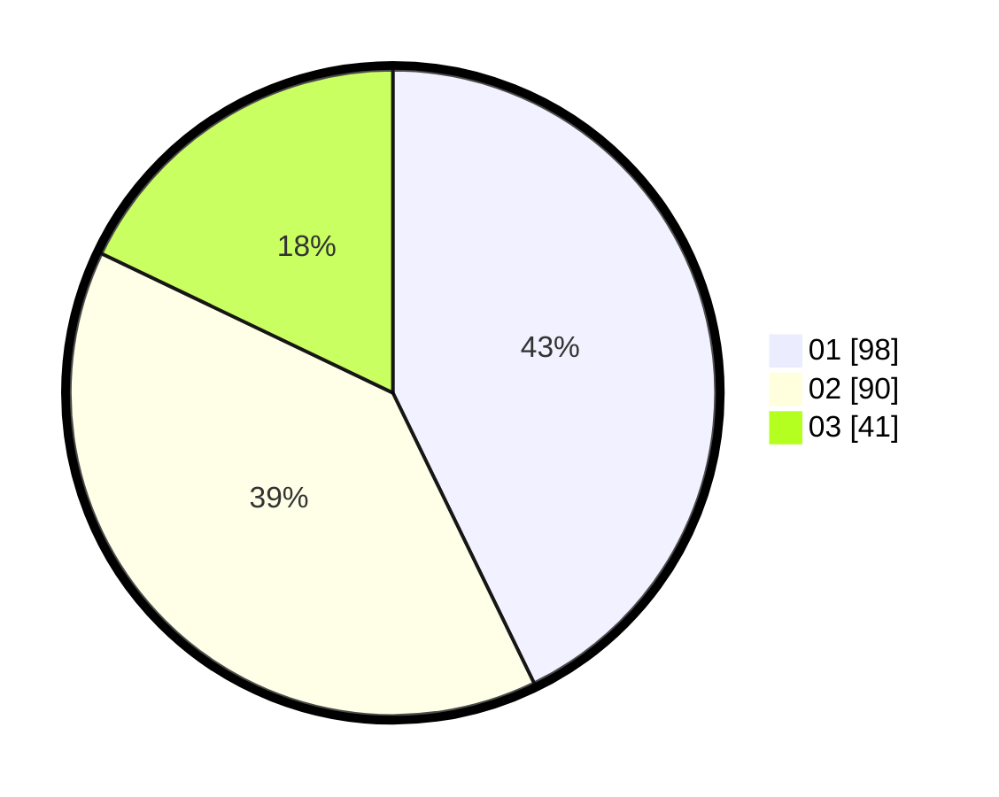

# Hasil

Hasil perolehan suara paslon dapat dilihat pada file paslon-01.txt, paslon-02.txt, dan paslon-03.txt.

Jika tidak ada, artinya data tersebut belum ada pada SIREKAP.

## Perolehan Suara

 * Paslon 01: **98**.
 * Paslon 02: **90**.
 * Paslon 03: **41**.

## Foto C Plano

https://sirekap-obj-formc.kpu.go.id/235b/pemilu/ppwp/31/74/07/10/09/3174071009038-20240219-193715--21a6b1cb-5667-45e0-b939-8db95adeee20.jpg

https://sirekap-obj-formc.kpu.go.id/235b/pemilu/ppwp/31/74/07/10/09/3174071009038-20240219-193753--caf88fa3-5b5f-44fa-8759-b9fe1e8bd92b.jpg

https://sirekap-obj-formc.kpu.go.id/235b/pemilu/ppwp/31/74/07/10/09/3174071009038-20240219-193849--3a67dc18-673f-43f3-8200-ae641e19dfdd.jpg

## DATA PEMILIH TETAP

Jumlah pemilih dalam DPT: **276**.
 * L: **131**.
 * P: **175**.

## DATA PENGGUNA HAK PILIH

Jumlah pengguna hak pilih dalam DPT: **222**.
 * L: **99**.
 * P: **123**.

Jumlah pengguna hak pilih dalam DPTb: **8**.
 * L: **5**.
 * P: **3**.

Jumlah pengguna hak pilih dalam DPK: **1**.
 * L: **1**.
 * P: **0**.

Jumlah pengguna hak pilih: **231**.
 * L: **105**.
 * P: **126**.

## JUMLAH SUARA SAH DAN TIDAK SAH

JUMLAH SELURUH SUARA SAH: **229**.

JUMLAH SUARA TIDAK SAH: **2**.

JUMLAH SELURUH SUARA SAH DAN SUARA TIDAK SAH: **231**.
