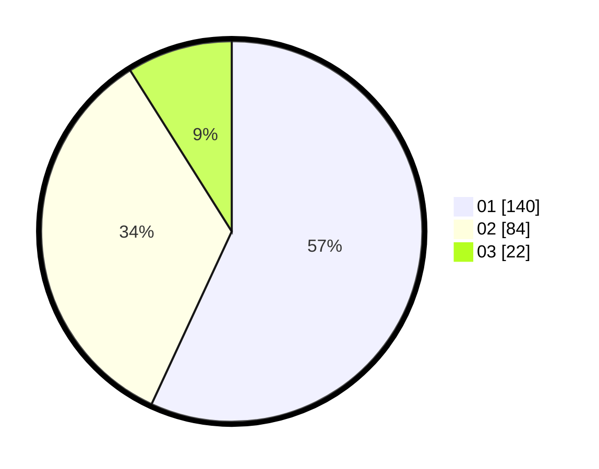

# Hasil

Hasil perolehan suara paslon dapat dilihat pada file paslon-01.txt, paslon-02.txt, dan paslon-03.txt.

Jika tidak ada, artinya data tersebut belum ada pada SIREKAP.

## Perolehan Suara

 * Paslon 01: **140**.
 * Paslon 02: **84**.
 * Paslon 03: **22**.

## Foto C Plano

https://sirekap-obj-formc.kpu.go.id/0956/pemilu/ppwp/31/74/07/10/09/3174071009039-20240219-183517--69f11323-d5a9-4ca4-a152-44f33e929b5f.jpg

https://sirekap-obj-formc.kpu.go.id/0956/pemilu/ppwp/31/74/07/10/09/3174071009039-20240219-183534--b16fe04c-9e09-4c4e-ade0-67ccc4bfed80.jpg

https://sirekap-obj-formc.kpu.go.id/0956/pemilu/ppwp/31/74/07/10/09/3174071009039-20240219-183654--e7925824-a213-4633-96fc-bc63f80adc47.jpg

## DATA PEMILIH TETAP

Jumlah pemilih dalam DPT: **286**.
 * L: **425**.
 * P: **454**.

## DATA PENGGUNA HAK PILIH

Jumlah pengguna hak pilih dalam DPT: **235**.
 * L: **9**.
 * P: **22**.

Jumlah pengguna hak pilih dalam DPTb: **888**.
 * L: **82**.
 * P: **880**.

Jumlah pengguna hak pilih dalam DPK: **886**.
 * L: **883**.
 * P: **883**.

Jumlah pengguna hak pilih: **249**.
 * L: **669**.
 * P: **439**.

## JUMLAH SUARA SAH DAN TIDAK SAH

JUMLAH SELURUH SUARA SAH: **235**.

JUMLAH SUARA TIDAK SAH: **883**.

JUMLAH SELURUH SUARA SAH DAN SUARA TIDAK SAH: **229**.
