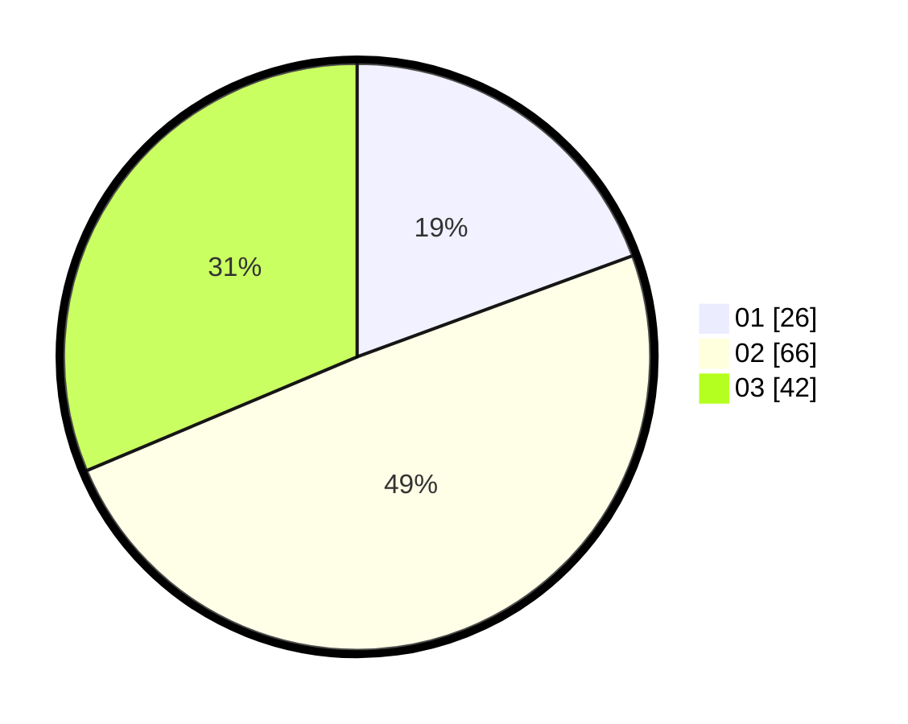

# Hasil

Hasil perolehan suara paslon dapat dilihat pada file paslon-01.txt, paslon-02.txt, dan paslon-03.txt.

Jika tidak ada, artinya data tersebut belum ada pada SIREKAP.

## Perolehan Suara

 * Paslon 01: **26**.
 * Paslon 02: **66**.
 * Paslon 03: **42**.

## Foto C Plano

https://sirekap-obj-formc.kpu.go.id/238e/pemilu/ppwp/31/74/07/10/09/3174071009052-20240215-213732--6d0e4d88-e7c5-4b8a-bd42-c2c93207f00f.jpg

https://sirekap-obj-formc.kpu.go.id/238e/pemilu/ppwp/31/74/07/10/09/3174071009052-20240215-213735--111d7dd8-0a5b-4d7d-b452-3fa995655a62.jpg

https://sirekap-obj-formc.kpu.go.id/238e/pemilu/ppwp/31/74/07/10/09/3174071009052-20240215-213733--1cb8219b-a9ef-4620-a4b9-1ef7005686fb.jpg

## DATA PEMILIH TETAP

Jumlah pemilih dalam DPT: **156**.
 * L: **74**.
 * P: **82**.

## DATA PENGGUNA HAK PILIH

Jumlah pengguna hak pilih dalam DPT: **123**.
 * L: **55**.
 * P: **68**.

Jumlah pengguna hak pilih dalam DPTb: **10**.
 * L: **6**.
 * P: **4**.

Jumlah pengguna hak pilih dalam DPK: **1**.
 * L: **0**.
 * P: **1**.

Jumlah pengguna hak pilih: **134**.
 * L: **61**.
 * P: **73**.

## JUMLAH SUARA SAH DAN TIDAK SAH

JUMLAH SELURUH SUARA SAH: **134**.

JUMLAH SUARA TIDAK SAH: **0**.

JUMLAH SELURUH SUARA SAH DAN SUARA TIDAK SAH: **134**.
