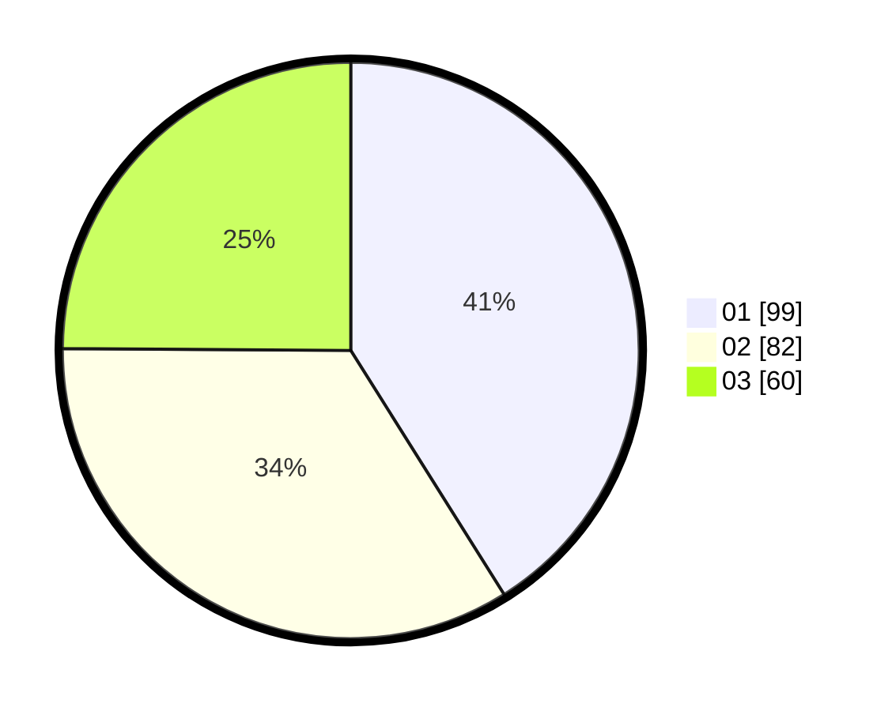

# Hasil

Hasil perolehan suara paslon dapat dilihat pada file paslon-01.txt, paslon-02.txt, dan paslon-03.txt.

Jika tidak ada, artinya data tersebut belum ada pada SIREKAP.

## Perolehan Suara

 * Paslon 01: **99**.
 * Paslon 02: **82**.
 * Paslon 03: **60**.

## Foto C Plano

https://sirekap-obj-formc.kpu.go.id/9caa/pemilu/ppwp/31/74/07/10/09/3174071009074-20240214-201330--7af97857-8ef7-4dcc-8b08-830c27f284fa.jpg

https://sirekap-obj-formc.kpu.go.id/9caa/pemilu/ppwp/31/74/07/10/09/3174071009074-20240214-201336--5dff3379-8c20-44f6-a63d-345cb748103f.jpg

https://sirekap-obj-formc.kpu.go.id/9caa/pemilu/ppwp/31/74/07/10/09/3174071009074-20240214-201347--00929aa9-6e1d-4d0b-a0e1-82ed9ba0e9de.jpg

## DATA PEMILIH TETAP

Jumlah pemilih dalam DPT: **293**.
 * L: **140**.
 * P: **153**.

## DATA PENGGUNA HAK PILIH

Jumlah pengguna hak pilih dalam DPT: **234**.
 * L: **106**.
 * P: **128**.

Jumlah pengguna hak pilih dalam DPTb: **9**.
 * L: **2**.
 * P: **7**.

Jumlah pengguna hak pilih dalam DPK: **4**.
 * L: **1**.
 * P: **3**.

Jumlah pengguna hak pilih: **247**.
 * L: **109**.
 * P: **138**.

## JUMLAH SUARA SAH DAN TIDAK SAH

JUMLAH SELURUH SUARA SAH: **241**.

JUMLAH SUARA TIDAK SAH: **6**.

JUMLAH SELURUH SUARA SAH DAN SUARA TIDAK SAH: **247**.
