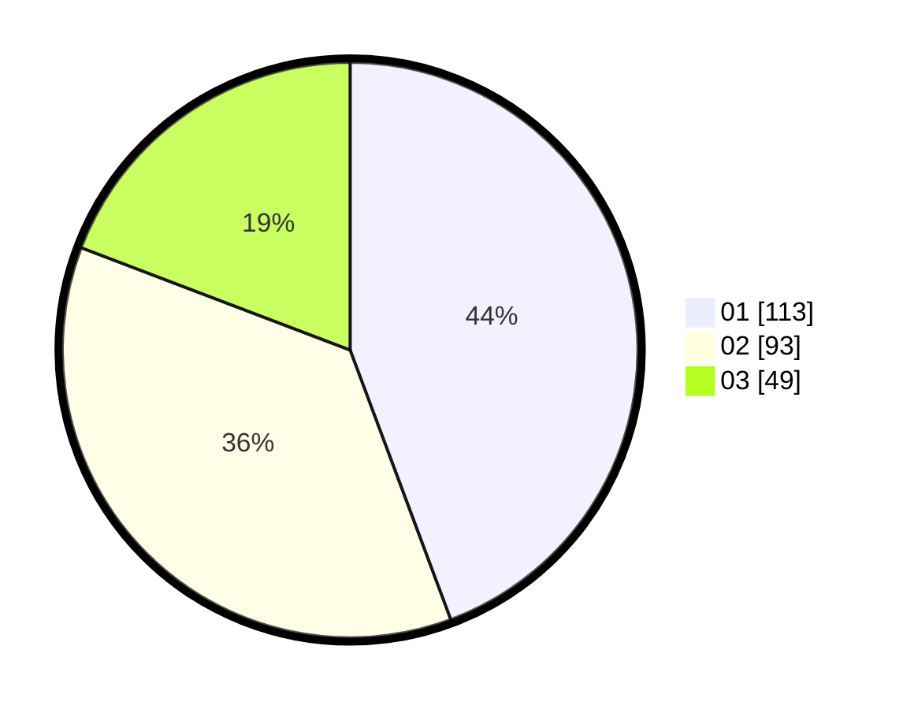

# Hasil

Hasil perolehan suara paslon dapat dilihat pada file paslon-01.txt, paslon-02.txt, dan paslon-03.txt.

Jika tidak ada, artinya data tersebut belum ada pada SIREKAP.

## Perolehan Suara

 * Paslon 01: **113**.
 * Paslon 02: **93**.
 * Paslon 03: **49**.

## Foto C Plano

https://sirekap-obj-formc.kpu.go.id/90c3/pemilu/ppwp/31/74/07/10/09/3174071009076-20240214-212842--a0bb34cc-fbd8-40d9-bcd8-453b9a9d87c3.jpg

https://sirekap-obj-formc.kpu.go.id/90c3/pemilu/ppwp/31/74/07/10/09/3174071009076-20240214-212933--1ea6559f-e986-49a3-b143-0fbb956bff30.jpg

https://sirekap-obj-formc.kpu.go.id/90c3/pemilu/ppwp/31/74/07/10/09/3174071009076-20240214-213100--108d9dce-6697-4ac1-b186-48e7a4b98270.jpg

## DATA PEMILIH TETAP

Jumlah pemilih dalam DPT: **289**.
 * L: **144**.
 * P: **145**.

## DATA PENGGUNA HAK PILIH

Jumlah pengguna hak pilih dalam DPT: **245**.
 * L: **122**.
 * P: **123**.

Jumlah pengguna hak pilih dalam DPTb: **11**.
 * L: **4**.
 * P: **7**.

Jumlah pengguna hak pilih dalam DPK: **1**.
 * L: **0**.
 * P: **1**.

Jumlah pengguna hak pilih: **257**.
 * L: **126**.
 * P: **131**.

## JUMLAH SUARA SAH DAN TIDAK SAH

JUMLAH SELURUH SUARA SAH: **255**.

JUMLAH SUARA TIDAK SAH: **2**.

JUMLAH SELURUH SUARA SAH DAN SUARA TIDAK SAH: **257**.
