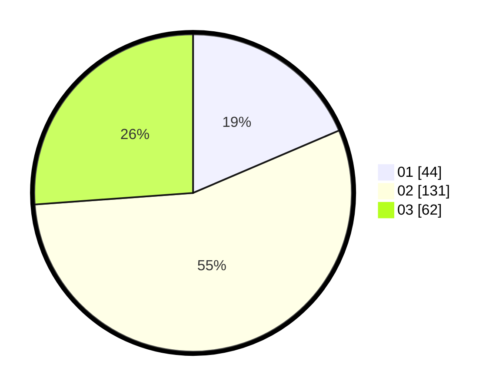

# Hasil

Hasil perolehan suara paslon dapat dilihat pada file paslon-01.txt, paslon-02.txt, dan paslon-03.txt.

Jika tidak ada, artinya data tersebut belum ada pada SIREKAP.

## Perolehan Suara

 * Paslon 01: **44**.
 * Paslon 02: **131**.
 * Paslon 03: **62**.

## Foto C Plano

https://sirekap-obj-formc.kpu.go.id/2268/pemilu/ppwp/31/74/07/10/09/3174071009090-20240215-234226--1da138f7-5a17-45ab-820c-28220357becd.jpg

https://sirekap-obj-formc.kpu.go.id/2268/pemilu/ppwp/31/74/07/10/09/3174071009090-20240215-234227--86d50839-6e51-4a7d-a4bb-59e170ec33cc.jpg

https://sirekap-obj-formc.kpu.go.id/2268/pemilu/ppwp/31/74/07/10/09/3174071009090-20240215-234227--2947df2b-2108-4618-98b8-37f2349eb32e.jpg

## DATA PEMILIH TETAP

Jumlah pemilih dalam DPT: **0**.
 * L: **0**.
 * P: **0**.

## DATA PENGGUNA HAK PILIH

Jumlah pengguna hak pilih dalam DPT: **0**.
 * L: **0**.
 * P: **0**.

Jumlah pengguna hak pilih dalam DPTb: **0**.
 * L: **0**.
 * P: **0**.

Jumlah pengguna hak pilih dalam DPK: **0**.
 * L: **0**.
 * P: **0**.

Jumlah pengguna hak pilih: **0**.
 * L: **0**.
 * P: **0**.

## JUMLAH SUARA SAH DAN TIDAK SAH

JUMLAH SELURUH SUARA SAH: **237**.

JUMLAH SUARA TIDAK SAH: **4**.

JUMLAH SELURUH SUARA SAH DAN SUARA TIDAK SAH: **241**.
