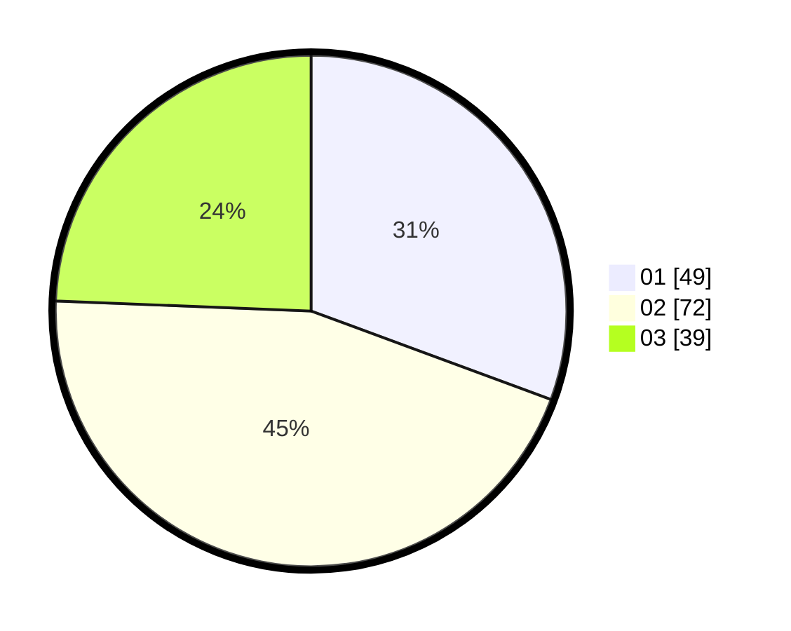

# Hasil

Hasil perolehan suara paslon dapat dilihat pada file paslon-01.txt, paslon-02.txt, dan paslon-03.txt.

Jika tidak ada, artinya data tersebut belum ada pada SIREKAP.

## Perolehan Suara

 * Paslon 01: **49**.
 * Paslon 02: **72**.
 * Paslon 03: **39**.

## Foto C Plano

https://sirekap-obj-formc.kpu.go.id/a75e/pemilu/ppwp/31/74/07/10/09/3174071009094-20240214-234401--ab23302b-be56-4d4a-851e-87ef5d1a91dd.jpg

https://sirekap-obj-formc.kpu.go.id/a75e/pemilu/ppwp/31/74/07/10/09/3174071009094-20240214-235005--5cb657a7-ca0d-451f-974b-a4b257f89dbb.jpg

https://sirekap-obj-formc.kpu.go.id/a75e/pemilu/ppwp/31/74/07/10/09/3174071009094-20240214-234851--cca28784-5c93-4ccc-8a61-ca53465ad526.jpg
