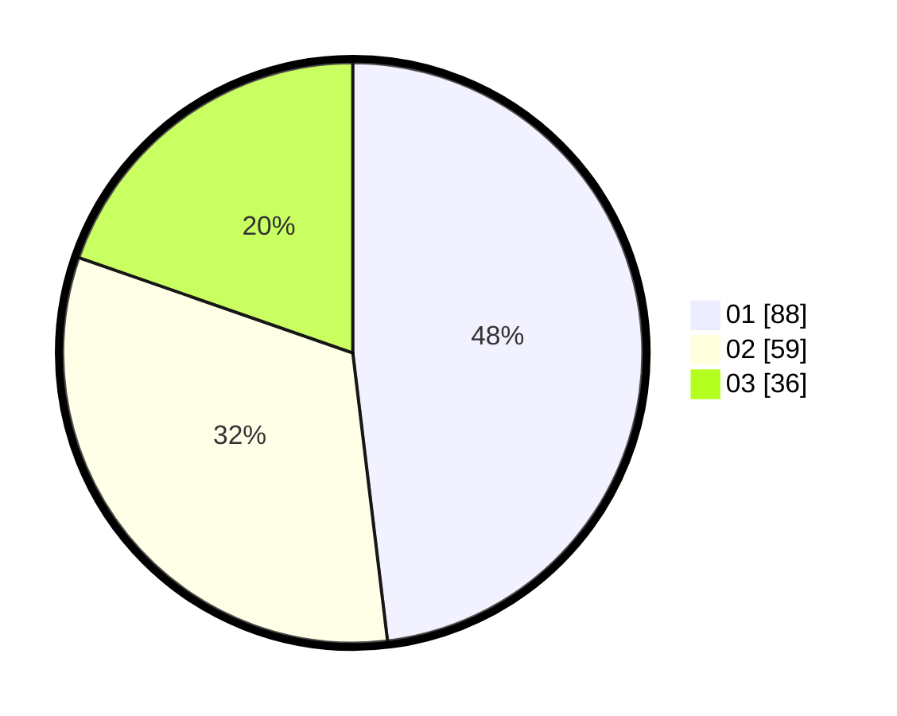

# Hasil

Hasil perolehan suara paslon dapat dilihat pada file paslon-01.txt, paslon-02.txt, dan paslon-03.txt.

Jika tidak ada, artinya data tersebut belum ada pada SIREKAP.

## Perolehan Suara

 * Paslon 01: **88**.
 * Paslon 02: **59**.
 * Paslon 03: **36**.

## Foto C Plano

https://sirekap-obj-formc.kpu.go.id/93dc/pemilu/ppwp/31/74/07/10/09/3174071009101-20240214-155551--55091421-210f-43d9-bf99-48fc376aabfe.jpg

https://sirekap-obj-formc.kpu.go.id/93dc/pemilu/ppwp/31/74/07/10/09/3174071009101-20240214-155157--c7cdb862-4ef5-4b4d-b1ba-c962506bd438.jpg

https://sirekap-obj-formc.kpu.go.id/93dc/pemilu/ppwp/31/74/07/10/09/3174071009101-20240214-155221--7b7a83b4-c14f-46b1-9d7c-5cf5495530d4.jpg

## DATA PEMILIH TETAP

Jumlah pemilih dalam DPT: **180**.
 * L: **84**.
 * P: **96**.

## DATA PENGGUNA HAK PILIH

Jumlah pengguna hak pilih dalam DPT: **180**.
 * L: **84**.
 * P: **96**.

Jumlah pengguna hak pilih dalam DPTb: **6**.
 * L: **5**.
 * P: **1**.

Jumlah pengguna hak pilih dalam DPK: **1**.
 * L: **0**.
 * P: **1**.

Jumlah pengguna hak pilih: **187**.
 * L: **89**.
 * P: **98**.

## JUMLAH SUARA SAH DAN TIDAK SAH

JUMLAH SELURUH SUARA SAH: **183**.

JUMLAH SUARA TIDAK SAH: **4**.

JUMLAH SELURUH SUARA SAH DAN SUARA TIDAK SAH: **187**.
