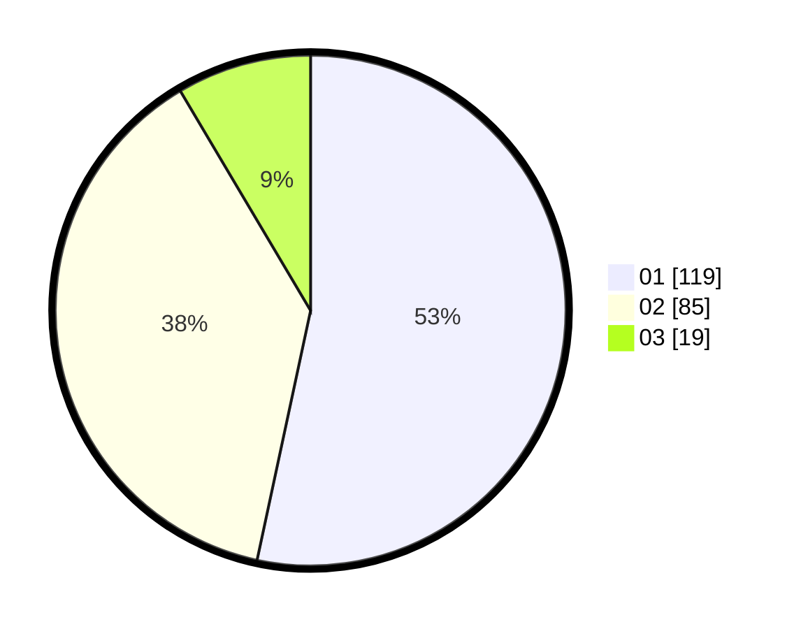

# Hasil

Hasil perolehan suara paslon dapat dilihat pada file paslon-01.txt, paslon-02.txt, dan paslon-03.txt.

Jika tidak ada, artinya data tersebut belum ada pada SIREKAP.

## Perolehan Suara

 * Paslon 01: **119**.
 * Paslon 02: **85**.
 * Paslon 03: **19**.

## Foto C Plano

https://sirekap-obj-formc.kpu.go.id/63f8/pemilu/ppwp/31/74/07/10/09/3174071009126-20240214-193234--15e3317e-1b3c-462b-a62b-1f8642eda91f.jpg

https://sirekap-obj-formc.kpu.go.id/63f8/pemilu/ppwp/31/74/07/10/09/3174071009126-20240214-193524--1601fc1b-3bc6-4615-a0bd-77fbbfde1833.jpg

https://sirekap-obj-formc.kpu.go.id/63f8/pemilu/ppwp/31/74/07/10/09/3174071009126-20240214-193548--f6e3757c-7e01-4b3c-82cf-8ae25f0ecde3.jpg

## DATA PEMILIH TETAP

Jumlah pemilih dalam DPT: **229**.
 * L: **107**.
 * P: **122**.

## DATA PENGGUNA HAK PILIH

Jumlah pengguna hak pilih dalam DPT: **277**.
 * L: **141**.
 * P: **136**.

Jumlah pengguna hak pilih dalam DPTb: **19**.
 * L: **2**.
 * P: **17**.

Jumlah pengguna hak pilih dalam DPK: **0**.
 * L: **0**.
 * P: **0**.

Jumlah pengguna hak pilih: **296**.
 * L: **143**.
 * P: **153**.

## JUMLAH SUARA SAH DAN TIDAK SAH

JUMLAH SELURUH SUARA SAH: **223**.

JUMLAH SUARA TIDAK SAH: **6**.

JUMLAH SELURUH SUARA SAH DAN SUARA TIDAK SAH: **229**.
