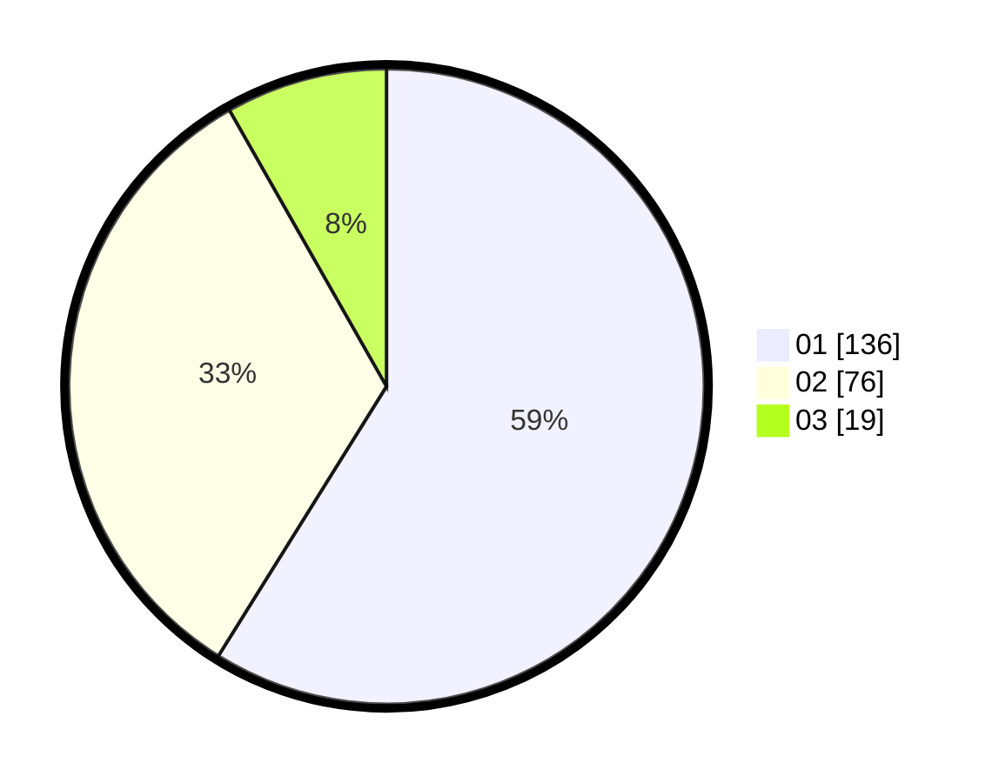

# Hasil

Hasil perolehan suara paslon dapat dilihat pada file paslon-01.txt, paslon-02.txt, dan paslon-03.txt.

Jika tidak ada, artinya data tersebut belum ada pada SIREKAP.

## Perolehan Suara

 * Paslon 01: **136**.
 * Paslon 02: **76**.
 * Paslon 03: **19**.

## Foto C Plano

https://sirekap-obj-formc.kpu.go.id/bde4/pemilu/ppwp/31/74/07/10/09/3174071009134-20240214-160059--2621cfb6-447e-4bfd-9d19-256a9f49d6ec.jpg

https://sirekap-obj-formc.kpu.go.id/bde4/pemilu/ppwp/31/74/07/10/09/3174071009134-20240214-155314--cb099d8b-9e1e-4702-94dd-63301619f128.jpg

https://sirekap-obj-formc.kpu.go.id/bde4/pemilu/ppwp/31/74/07/10/09/3174071009134-20240214-155420--262a7dd9-aeeb-43fc-b362-d567d28b9638.jpg
