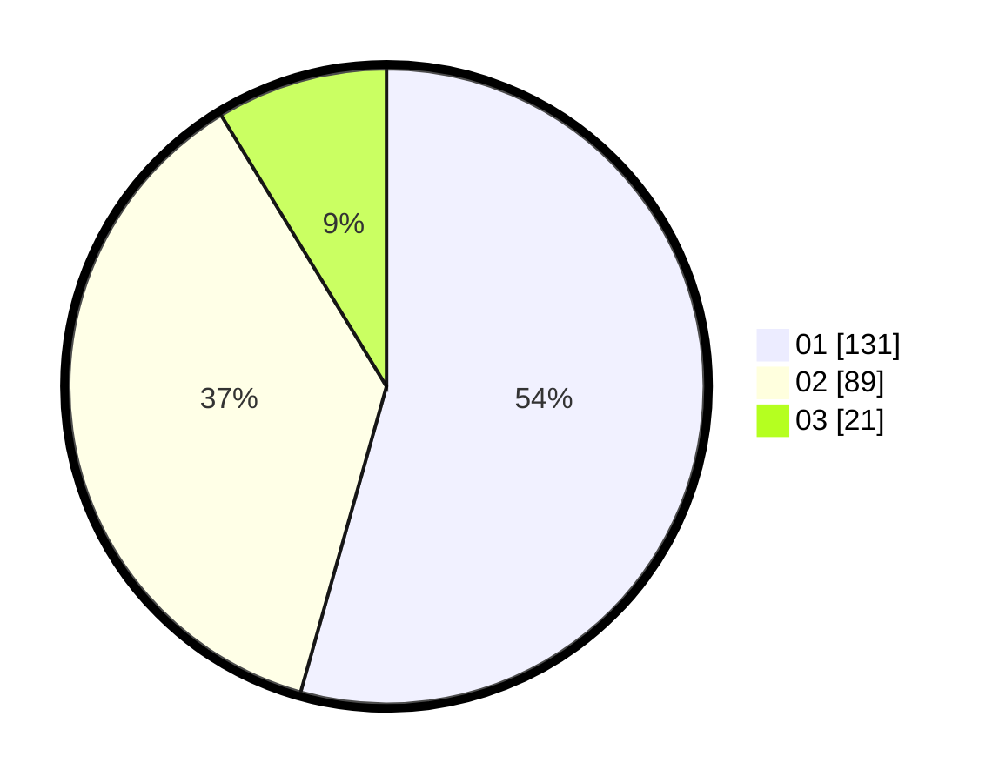

# Hasil

Hasil perolehan suara paslon dapat dilihat pada file paslon-01.txt, paslon-02.txt, dan paslon-03.txt.

Jika tidak ada, artinya data tersebut belum ada pada SIREKAP.

## Perolehan Suara

 * Paslon 01: **131**.
 * Paslon 02: **89**.
 * Paslon 03: **21**.

## Foto C Plano

https://sirekap-obj-formc.kpu.go.id/a043/pemilu/ppwp/31/74/07/10/09/3174071009136-20240214-203049--8739eb91-cc3e-4201-8cc9-1911089b8fd7.jpg

https://sirekap-obj-formc.kpu.go.id/a043/pemilu/ppwp/31/74/07/10/09/3174071009136-20240214-235919--4205b241-dc7a-4bdf-b500-9229357b4797.jpg

https://sirekap-obj-formc.kpu.go.id/a043/pemilu/ppwp/31/74/07/10/09/3174071009136-20240214-203114--b6dc703f-4a3c-41c3-9e49-fcfe4cadd191.jpg

## DATA PEMILIH TETAP

Jumlah pemilih dalam DPT: **296**.
 * L: **143**.
 * P: **153**.

## DATA PENGGUNA HAK PILIH

Jumlah pengguna hak pilih dalam DPT: **232**.
 * L: **111**.
 * P: **121**.

Jumlah pengguna hak pilih dalam DPTb: **10**.
 * L: **2**.
 * P: **8**.

Jumlah pengguna hak pilih dalam DPK: **0**.
 * L: **0**.
 * P: **0**.

Jumlah pengguna hak pilih: **242**.
 * L: **113**.
 * P: **129**.

## JUMLAH SUARA SAH DAN TIDAK SAH

JUMLAH SELURUH SUARA SAH: **241**.

JUMLAH SUARA TIDAK SAH: **1**.

JUMLAH SELURUH SUARA SAH DAN SUARA TIDAK SAH: **242**.
