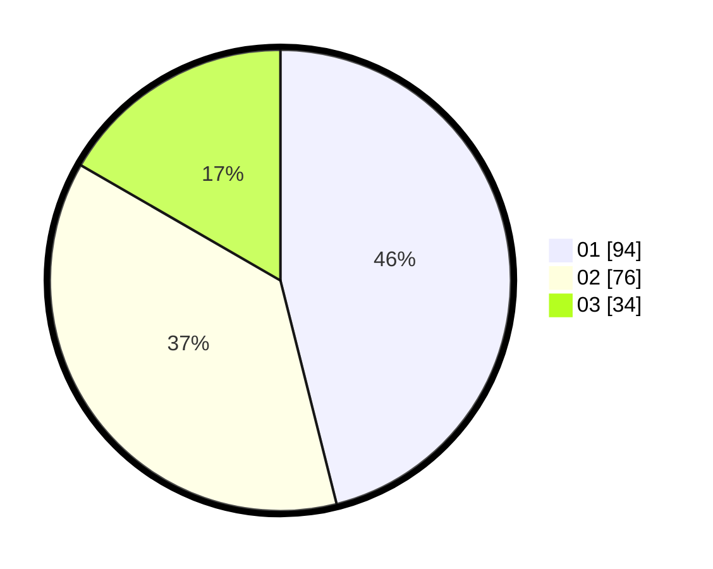

# Hasil

Hasil perolehan suara paslon dapat dilihat pada file paslon-01.txt, paslon-02.txt, dan paslon-03.txt.

Jika tidak ada, artinya data tersebut belum ada pada SIREKAP.

## Perolehan Suara

 * Paslon 01: **94**.
 * Paslon 02: **76**.
 * Paslon 03: **34**.

## Foto C Plano

https://sirekap-obj-formc.kpu.go.id/ac08/pemilu/ppwp/31/74/07/10/10/3174071010001-20240219-132234--5a2f3e72-7fb1-46df-b8e7-c0a1fcb8c632.jpg

https://sirekap-obj-formc.kpu.go.id/ac08/pemilu/ppwp/31/74/07/10/10/3174071010001-20240219-133149--02d7ad18-9190-4612-8ff6-f1d92d89b7b9.jpg

https://sirekap-obj-formc.kpu.go.id/ac08/pemilu/ppwp/31/74/07/10/10/3174071010001-20240219-133554--ad6d0492-3736-48fc-ba57-f43300469fa3.jpg

## DATA PEMILIH TETAP

Jumlah pemilih dalam DPT: **252**.
 * L: **132**.
 * P: **120**.

## DATA PENGGUNA HAK PILIH

Jumlah pengguna hak pilih dalam DPT: **201**.
 * L: **102**.
 * P: **99**.

Jumlah pengguna hak pilih dalam DPTb: **6**.
 * L: **3**.
 * P: **3**.

Jumlah pengguna hak pilih dalam DPK: **0**.
 * L: **0**.
 * P: **0**.

Jumlah pengguna hak pilih: **207**.
 * L: **105**.
 * P: **102**.

## JUMLAH SUARA SAH DAN TIDAK SAH

JUMLAH SELURUH SUARA SAH: **204**.

JUMLAH SUARA TIDAK SAH: **3**.

JUMLAH SELURUH SUARA SAH DAN SUARA TIDAK SAH: **207**.
