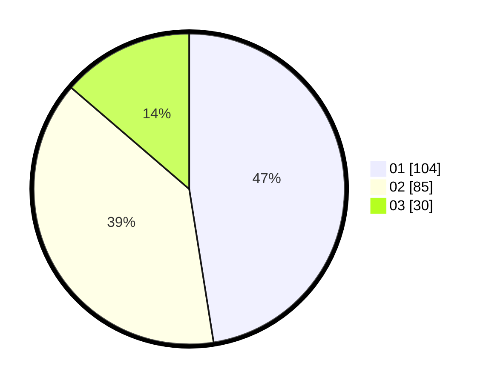

# Hasil

Hasil perolehan suara paslon dapat dilihat pada file paslon-01.txt, paslon-02.txt, dan paslon-03.txt.

Jika tidak ada, artinya data tersebut belum ada pada SIREKAP.

## Perolehan Suara

 * Paslon 01: **104**.
 * Paslon 02: **85**.
 * Paslon 03: **30**.

## Foto C Plano

https://sirekap-obj-formc.kpu.go.id/4b33/pemilu/ppwp/31/74/07/10/10/3174071010010-20240219-182240--e4d519f3-a46d-4d02-8f49-0f855d4f8f9f.jpg

https://sirekap-obj-formc.kpu.go.id/4b33/pemilu/ppwp/31/74/07/10/10/3174071010010-20240219-182400--29638c4b-44de-4008-85c7-80dabadcbb2e.jpg

https://sirekap-obj-formc.kpu.go.id/4b33/pemilu/ppwp/31/74/07/10/10/3174071010010-20240219-182716--c73dbca1-8040-4efa-8222-a3125f7b550d.jpg

## DATA PEMILIH TETAP

Jumlah pemilih dalam DPT: **262**.
 * L: **137**.
 * P: **125**.

## DATA PENGGUNA HAK PILIH

Jumlah pengguna hak pilih dalam DPT: **216**.
 * L: **114**.
 * P: **102**.

Jumlah pengguna hak pilih dalam DPTb: **2**.
 * L: **1**.
 * P: **1**.

Jumlah pengguna hak pilih dalam DPK: **2**.
 * L: **1**.
 * P: **1**.

Jumlah pengguna hak pilih: **220**.
 * L: **116**.
 * P: **104**.

## JUMLAH SUARA SAH DAN TIDAK SAH

JUMLAH SELURUH SUARA SAH: **219**.

JUMLAH SUARA TIDAK SAH: **2**.

JUMLAH SELURUH SUARA SAH DAN SUARA TIDAK SAH: **221**.
