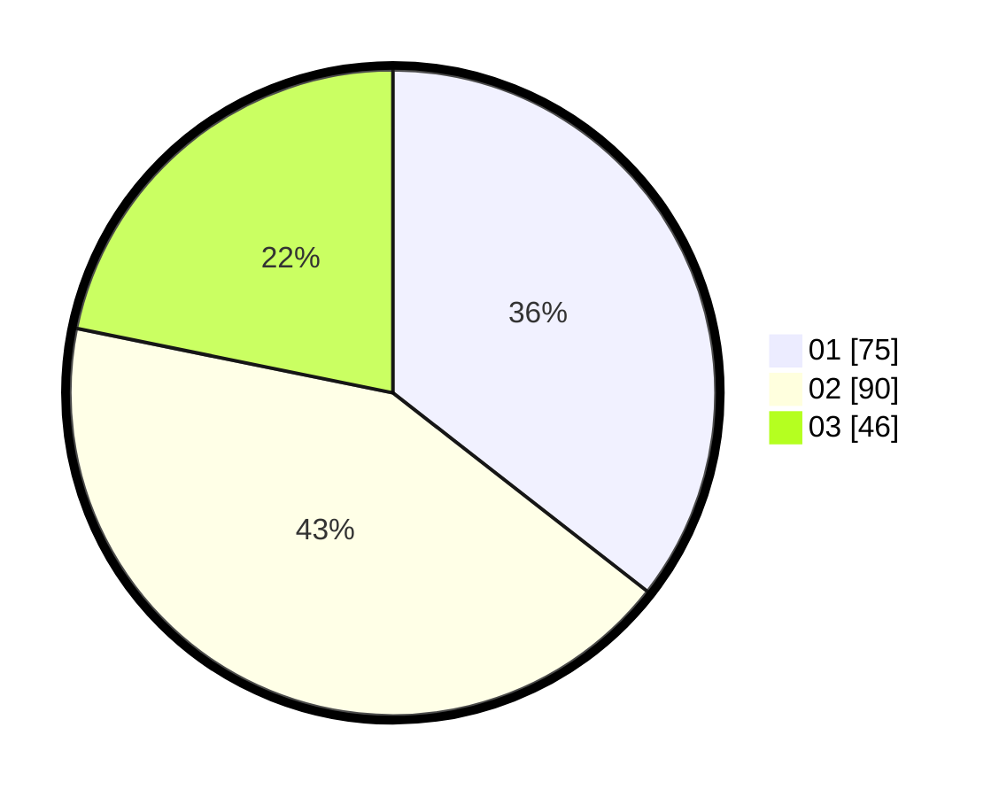

# Hasil

Hasil perolehan suara paslon dapat dilihat pada file paslon-01.txt, paslon-02.txt, dan paslon-03.txt.

Jika tidak ada, artinya data tersebut belum ada pada SIREKAP.

## Perolehan Suara

 * Paslon 01: **75**.
 * Paslon 02: **90**.
 * Paslon 03: **46**.

## Foto C Plano

https://sirekap-obj-formc.kpu.go.id/e753/pemilu/ppwp/31/74/07/10/10/3174071010017-20240214-193517--77028b01-e046-4893-bb83-13a5e9d7c8e2.jpg

https://sirekap-obj-formc.kpu.go.id/e753/pemilu/ppwp/31/74/07/10/10/3174071010017-20240214-193527--6f45faba-ab7e-48e8-ba54-a6cbfc9bace2.jpg

https://sirekap-obj-formc.kpu.go.id/e753/pemilu/ppwp/31/74/07/10/10/3174071010017-20240214-193539--737e48ec-4d01-411c-9a75-b283b09f81f4.jpg

## DATA PEMILIH TETAP

Jumlah pemilih dalam DPT: **258**.
 * L: **133**.
 * P: **125**.

## DATA PENGGUNA HAK PILIH

Jumlah pengguna hak pilih dalam DPT: **200**.
 * L: **101**.
 * P: **99**.

Jumlah pengguna hak pilih dalam DPTb: **11**.
 * L: **10**.
 * P: **1**.

Jumlah pengguna hak pilih dalam DPK: **1**.
 * L: **1**.
 * P: **0**.

Jumlah pengguna hak pilih: **212**.
 * L: **112**.
 * P: **100**.

## JUMLAH SUARA SAH DAN TIDAK SAH

JUMLAH SELURUH SUARA SAH: **211**.

JUMLAH SUARA TIDAK SAH: **1**.

JUMLAH SELURUH SUARA SAH DAN SUARA TIDAK SAH: **212**.
