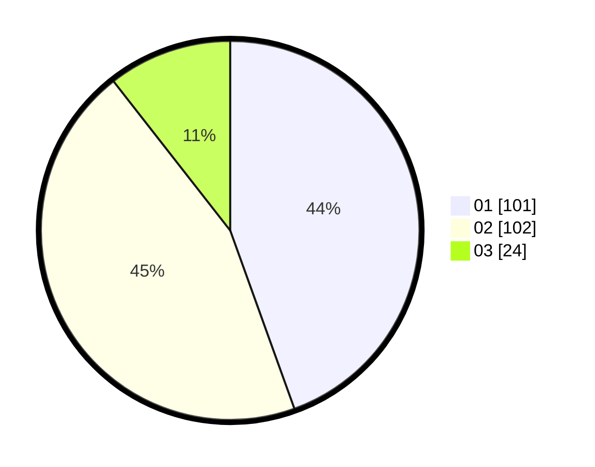

# Hasil

Hasil perolehan suara paslon dapat dilihat pada file paslon-01.txt, paslon-02.txt, dan paslon-03.txt.

Jika tidak ada, artinya data tersebut belum ada pada SIREKAP.

## Perolehan Suara

 * Paslon 01: **101**.
 * Paslon 02: **102**.
 * Paslon 03: **24**.

## Foto C Plano

https://sirekap-obj-formc.kpu.go.id/3bd8/pemilu/ppwp/31/74/07/10/10/3174071010028-20240214-155032--e9c5ebc8-5d0c-4e9d-9d73-f48442e9963e.jpg

https://sirekap-obj-formc.kpu.go.id/3bd8/pemilu/ppwp/31/74/07/10/10/3174071010028-20240214-155224--b8d75da3-659e-4b10-9cd9-d5ef9f570623.jpg

https://sirekap-obj-formc.kpu.go.id/3bd8/pemilu/ppwp/31/74/07/10/10/3174071010028-20240214-155405--160f443f-9363-4bc8-a8f3-5e48ec6d4b13.jpg

## DATA PEMILIH TETAP

Jumlah pemilih dalam DPT: **281**.
 * L: **136**.
 * P: **145**.

## DATA PENGGUNA HAK PILIH

Jumlah pengguna hak pilih dalam DPT: **226**.
 * L: **111**.
 * P: **115**.

Jumlah pengguna hak pilih dalam DPTb: **2**.
 * L: **1**.
 * P: **1**.

Jumlah pengguna hak pilih dalam DPK: **0**.
 * L: **0**.
 * P: **0**.

Jumlah pengguna hak pilih: **228**.
 * L: **112**.
 * P: **116**.

## JUMLAH SUARA SAH DAN TIDAK SAH

JUMLAH SELURUH SUARA SAH: **227**.

JUMLAH SUARA TIDAK SAH: **1**.

JUMLAH SELURUH SUARA SAH DAN SUARA TIDAK SAH: **228**.
