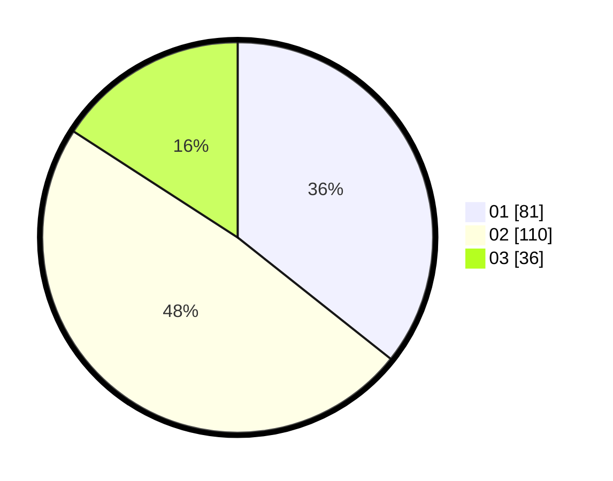

# Hasil

Hasil perolehan suara paslon dapat dilihat pada file paslon-01.txt, paslon-02.txt, dan paslon-03.txt.

Jika tidak ada, artinya data tersebut belum ada pada SIREKAP.

## Perolehan Suara

 * Paslon 01: **81**.
 * Paslon 02: **110**.
 * Paslon 03: **36**.

## Foto C Plano

https://sirekap-obj-formc.kpu.go.id/8679/pemilu/ppwp/31/74/07/10/10/3174071010038-20240214-193647--d8653642-dec5-4c67-9a98-4bd78e544429.jpg

https://sirekap-obj-formc.kpu.go.id/8679/pemilu/ppwp/31/74/07/10/10/3174071010038-20240214-190922--f5399d6a-d0e0-4b5f-86ec-c9ad9e4cffe3.jpg

https://sirekap-obj-formc.kpu.go.id/8679/pemilu/ppwp/31/74/07/10/10/3174071010038-20240214-160122--30a4998b-7590-42d8-98b5-2accd88e5d56.jpg

## DATA PEMILIH TETAP

Jumlah pemilih dalam DPT: **293**.
 * L: **142**.
 * P: **151**.

## DATA PENGGUNA HAK PILIH

Jumlah pengguna hak pilih dalam DPT: **230**.
 * L: **112**.
 * P: **118**.

Jumlah pengguna hak pilih dalam DPTb: **1**.
 * L: **1**.
 * P: **0**.

Jumlah pengguna hak pilih dalam DPK: **0**.
 * L: **0**.
 * P: **0**.

Jumlah pengguna hak pilih: **231**.
 * L: **113**.
 * P: **118**.

## JUMLAH SUARA SAH DAN TIDAK SAH

JUMLAH SELURUH SUARA SAH: **227**.

JUMLAH SUARA TIDAK SAH: **4**.

JUMLAH SELURUH SUARA SAH DAN SUARA TIDAK SAH: **231**.
