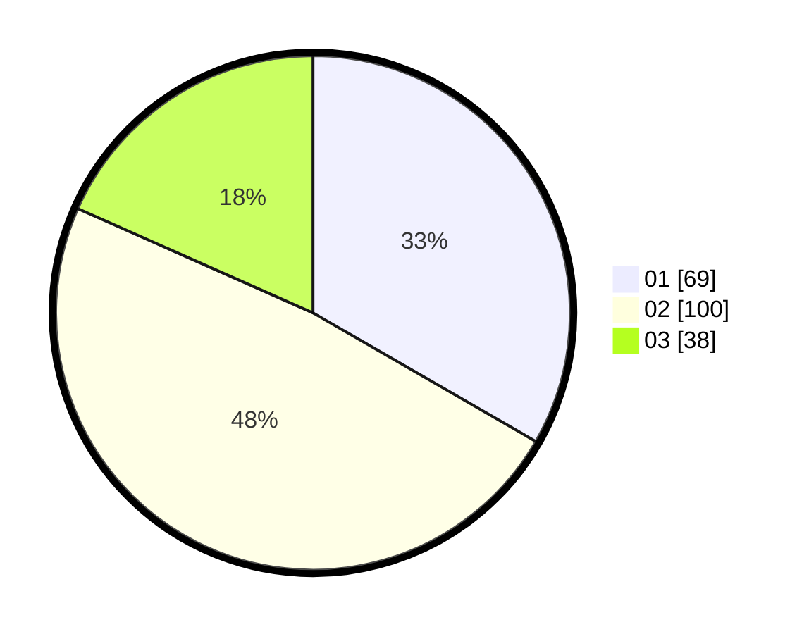

# Hasil

Hasil perolehan suara paslon dapat dilihat pada file paslon-01.txt, paslon-02.txt, dan paslon-03.txt.

Jika tidak ada, artinya data tersebut belum ada pada SIREKAP.

## Perolehan Suara

 * Paslon 01: **69**.
 * Paslon 02: **100**.
 * Paslon 03: **38**.

## Foto C Plano

https://sirekap-obj-formc.kpu.go.id/e70e/pemilu/ppwp/31/74/07/10/10/3174071010040-20240214-193312--dd3e5f14-37fa-43d7-80c4-5a0ba79e9b5c.jpg

https://sirekap-obj-formc.kpu.go.id/e70e/pemilu/ppwp/31/74/07/10/10/3174071010040-20240214-202541--1559d74a-52ae-44b7-a4d5-6bf6ed30a068.jpg

https://sirekap-obj-formc.kpu.go.id/e70e/pemilu/ppwp/31/74/07/10/10/3174071010040-20240214-202841--2c85e4c1-141e-4f2d-9d0a-b93491b64c79.jpg

## DATA PEMILIH TETAP

Jumlah pemilih dalam DPT: **261**.
 * L: **132**.
 * P: **129**.

## DATA PENGGUNA HAK PILIH

Jumlah pengguna hak pilih dalam DPT: **205**.
 * L: **102**.
 * P: **103**.

Jumlah pengguna hak pilih dalam DPTb: **3**.
 * L: **2**.
 * P: **1**.

Jumlah pengguna hak pilih dalam DPK: **1**.
 * L: **1**.
 * P: **0**.

Jumlah pengguna hak pilih: **209**.
 * L: **105**.
 * P: **104**.

## JUMLAH SUARA SAH DAN TIDAK SAH

JUMLAH SELURUH SUARA SAH: **207**.

JUMLAH SUARA TIDAK SAH: **2**.

JUMLAH SELURUH SUARA SAH DAN SUARA TIDAK SAH: **209**.
