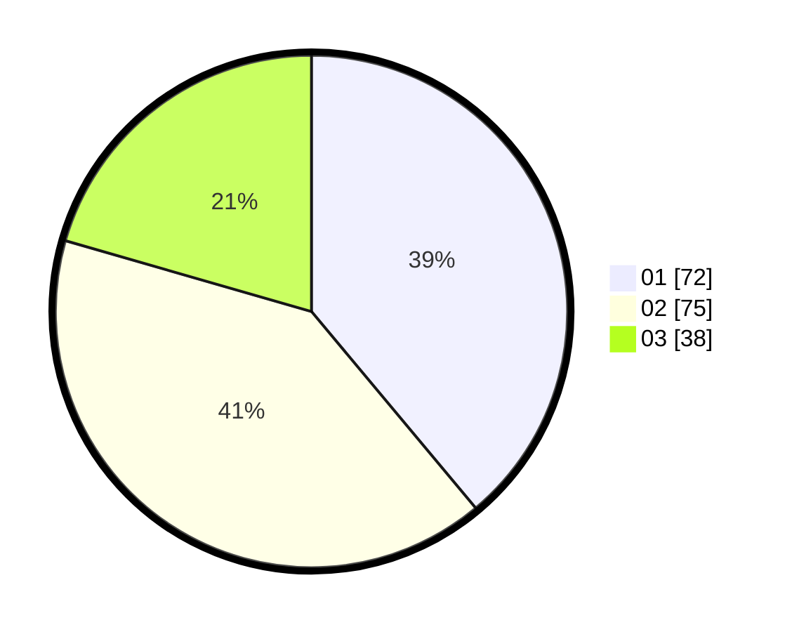

# Hasil

Hasil perolehan suara paslon dapat dilihat pada file paslon-01.txt, paslon-02.txt, dan paslon-03.txt.

Jika tidak ada, artinya data tersebut belum ada pada SIREKAP.

## Perolehan Suara

 * Paslon 01: **72**.
 * Paslon 02: **75**.
 * Paslon 03: **38**.

## Foto C Plano

https://sirekap-obj-formc.kpu.go.id/d6fd/pemilu/ppwp/31/74/07/10/10/3174071010055-20240214-194037--cb9d097b-2c01-4a86-bf25-c8b2a94aca5e.jpg

https://sirekap-obj-formc.kpu.go.id/d6fd/pemilu/ppwp/31/74/07/10/10/3174071010055-20240214-194205--64813127-e973-49aa-8eac-020bffc4e15b.jpg

https://sirekap-obj-formc.kpu.go.id/d6fd/pemilu/ppwp/31/74/07/10/10/3174071010055-20240214-194320--18c1f693-1364-41a4-a49d-ca7c5564a8b7.jpg

## DATA PEMILIH TETAP

Jumlah pemilih dalam DPT: **254**.
 * L: **128**.
 * P: **126**.

## DATA PENGGUNA HAK PILIH

Jumlah pengguna hak pilih dalam DPT: **187**.
 * L: **89**.
 * P: **98**.

Jumlah pengguna hak pilih dalam DPTb: **1**.
 * L: **0**.
 * P: **1**.

Jumlah pengguna hak pilih dalam DPK: **0**.
 * L: **0**.
 * P: **0**.

Jumlah pengguna hak pilih: **188**.
 * L: **89**.
 * P: **99**.

## JUMLAH SUARA SAH DAN TIDAK SAH

JUMLAH SELURUH SUARA SAH: **185**.

JUMLAH SUARA TIDAK SAH: **3**.

JUMLAH SELURUH SUARA SAH DAN SUARA TIDAK SAH: **188**.
