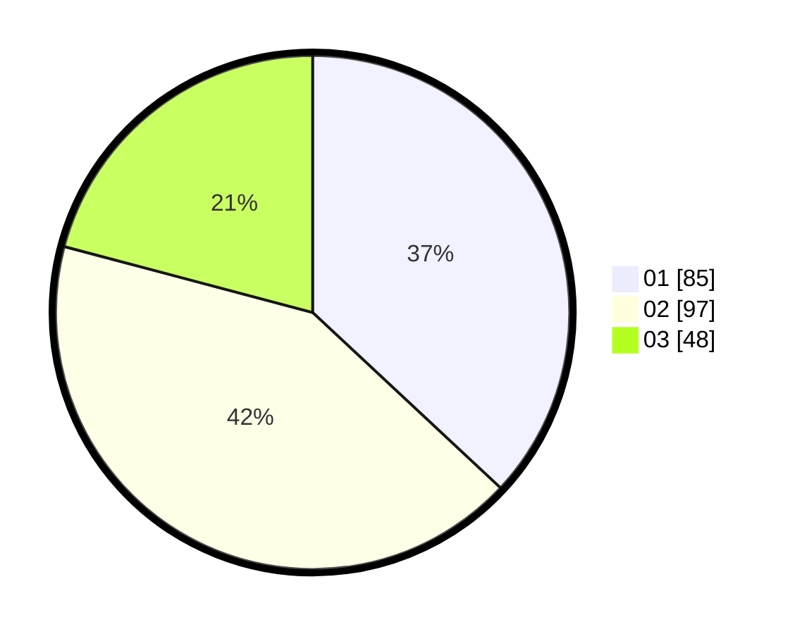

# Hasil

Hasil perolehan suara paslon dapat dilihat pada file paslon-01.txt, paslon-02.txt, dan paslon-03.txt.

Jika tidak ada, artinya data tersebut belum ada pada SIREKAP.

## Perolehan Suara

 * Paslon 01: **85**.
 * Paslon 02: **97**.
 * Paslon 03: **48**.

## Foto C Plano

https://sirekap-obj-formc.kpu.go.id/0d87/pemilu/ppwp/31/74/07/10/10/3174071010084-20240214-223817--59bfa68a-c6a3-48bf-8de0-9ef85efaa300.jpg

https://sirekap-obj-formc.kpu.go.id/0d87/pemilu/ppwp/31/74/07/10/10/3174071010084-20240214-201212--f362856e-cc6b-4a9d-bb9f-a91c4bde89f6.jpg

https://sirekap-obj-formc.kpu.go.id/0d87/pemilu/ppwp/31/74/07/10/10/3174071010084-20240214-204749--e081634a-1240-4ed0-9c51-42cd9ba65d15.jpg
