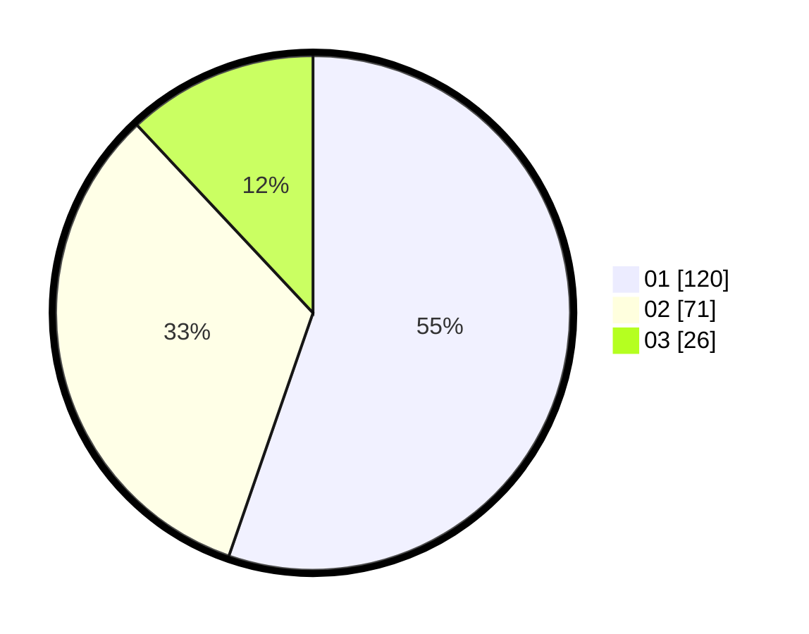

# Hasil

Hasil perolehan suara paslon dapat dilihat pada file paslon-01.txt, paslon-02.txt, dan paslon-03.txt.

Jika tidak ada, artinya data tersebut belum ada pada SIREKAP.

## Perolehan Suara

 * Paslon 01: **120**.
 * Paslon 02: **71**.
 * Paslon 03: **26**.

## Foto C Plano

https://sirekap-obj-formc.kpu.go.id/537c/pemilu/ppwp/31/74/07/10/10/3174071010095-20240214-213853--3d7d1582-44a8-4f47-b7dd-96f8ea168518.jpg

https://sirekap-obj-formc.kpu.go.id/537c/pemilu/ppwp/31/74/07/10/10/3174071010095-20240214-213914--f8a6a472-1839-4733-acf3-39bef78f7aa5.jpg

https://sirekap-obj-formc.kpu.go.id/537c/pemilu/ppwp/31/74/07/10/10/3174071010095-20240214-213904--7eae905b-ffac-47f2-baf7-f37e719b8360.jpg

## DATA PEMILIH TETAP

Jumlah pemilih dalam DPT: **266**.
 * L: **144**.
 * P: **122**.

## DATA PENGGUNA HAK PILIH

Jumlah pengguna hak pilih dalam DPT: **202**.
 * L: **105**.
 * P: **97**.

Jumlah pengguna hak pilih dalam DPTb: **15**.
 * L: **5**.
 * P: **10**.

Jumlah pengguna hak pilih dalam DPK: **0**.
 * L: **0**.
 * P: **0**.

Jumlah pengguna hak pilih: **217**.
 * L: **110**.
 * P: **107**.

## JUMLAH SUARA SAH DAN TIDAK SAH

JUMLAH SELURUH SUARA SAH: **217**.

JUMLAH SUARA TIDAK SAH: **0**.

JUMLAH SELURUH SUARA SAH DAN SUARA TIDAK SAH: **217**.
