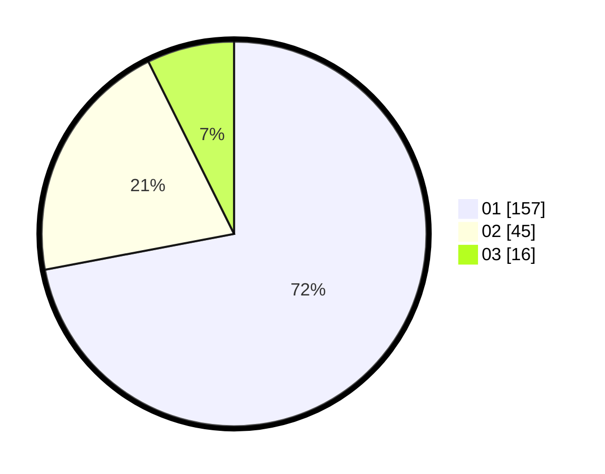

# Hasil

Hasil perolehan suara paslon dapat dilihat pada file paslon-01.txt, paslon-02.txt, dan paslon-03.txt.

Jika tidak ada, artinya data tersebut belum ada pada SIREKAP.

## Perolehan Suara

 * Paslon 01: **157**.
 * Paslon 02: **45**.
 * Paslon 03: **16**.

## Foto C Plano

https://sirekap-obj-formc.kpu.go.id/4050/pemilu/ppwp/31/74/08/10/01/3174081001002-20240214-205612--71c79eb5-1226-4175-9ae0-06739ca8294f.jpg

https://sirekap-obj-formc.kpu.go.id/4050/pemilu/ppwp/31/74/08/10/01/3174081001002-20240217-155538--d547459a-f7b0-40f3-aedb-60a17933bba8.jpg

https://sirekap-obj-formc.kpu.go.id/4050/pemilu/ppwp/31/74/08/10/01/3174081001002-20240217-155637--facafcf0-02d5-4bb4-87fe-d78300ec4a30.jpg

## DATA PEMILIH TETAP

Jumlah pemilih dalam DPT: **246**.
 * L: **130**.
 * P: **116**.

## DATA PENGGUNA HAK PILIH

Jumlah pengguna hak pilih dalam DPT: **201**.
 * L: **105**.
 * P: **96**.

Jumlah pengguna hak pilih dalam DPTb: **18**.
 * L: **1**.
 * P: **17**.

Jumlah pengguna hak pilih dalam DPK: **0**.
 * L: **0**.
 * P: **0**.

Jumlah pengguna hak pilih: **219**.
 * L: **106**.
 * P: **113**.

## JUMLAH SUARA SAH DAN TIDAK SAH

JUMLAH SELURUH SUARA SAH: **218**.

JUMLAH SUARA TIDAK SAH: **1**.

JUMLAH SELURUH SUARA SAH DAN SUARA TIDAK SAH: **219**.
