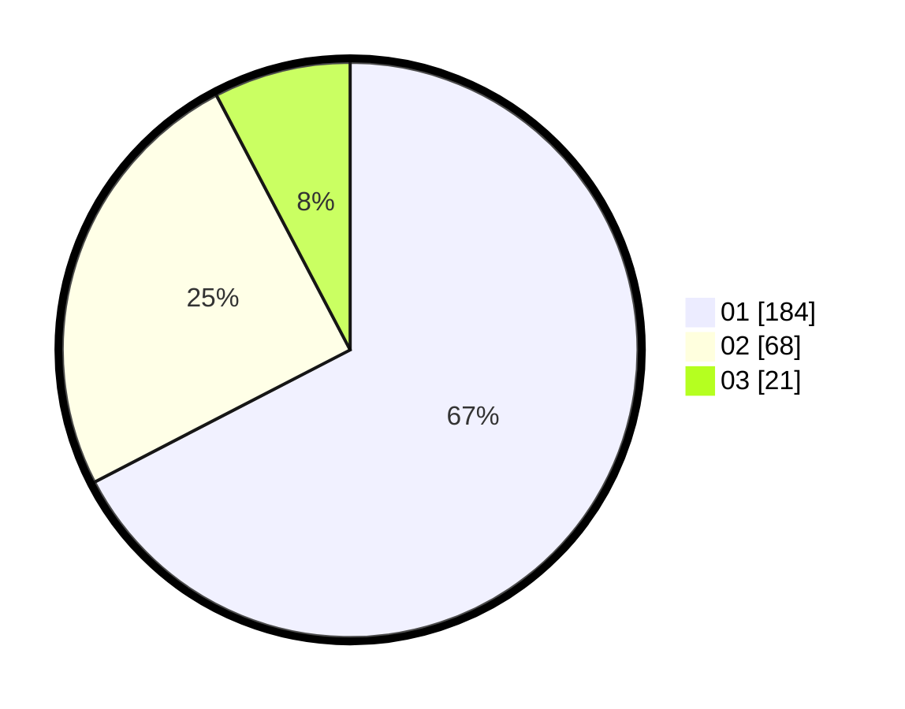

# Hasil

Hasil perolehan suara paslon dapat dilihat pada file paslon-01.txt, paslon-02.txt, dan paslon-03.txt.

Jika tidak ada, artinya data tersebut belum ada pada SIREKAP.

## Perolehan Suara

 * Paslon 01: **184**.
 * Paslon 02: **68**.
 * Paslon 03: **21**.

## Foto C Plano

https://sirekap-obj-formc.kpu.go.id/9813/pemilu/ppwp/31/74/08/10/01/3174081001005-20240217-184335--79d71669-45e1-46fc-93fa-22dcdd168e45.jpg

https://sirekap-obj-formc.kpu.go.id/9813/pemilu/ppwp/31/74/08/10/01/3174081001005-20240217-170541--89805199-0d2c-4ec4-87f6-6299436ca117.jpg

https://sirekap-obj-formc.kpu.go.id/9813/pemilu/ppwp/31/74/08/10/01/3174081001005-20240217-174249--82f4e9c9-62e6-4e06-a50d-b44339737c7a.jpg

## DATA PEMILIH TETAP

Jumlah pemilih dalam DPT: **290**.
 * L: **133**.
 * P: **157**.

## DATA PENGGUNA HAK PILIH

Jumlah pengguna hak pilih dalam DPT: **255**.
 * L: **116**.
 * P: **139**.

Jumlah pengguna hak pilih dalam DPTb: **21**.
 * L: **10**.
 * P: **11**.

Jumlah pengguna hak pilih dalam DPK: **1**.
 * L: **1**.
 * P: **0**.

Jumlah pengguna hak pilih: **277**.
 * L: **127**.
 * P: **150**.

## JUMLAH SUARA SAH DAN TIDAK SAH

JUMLAH SELURUH SUARA SAH: **273**.

JUMLAH SUARA TIDAK SAH: **4**.

JUMLAH SELURUH SUARA SAH DAN SUARA TIDAK SAH: **277**.
