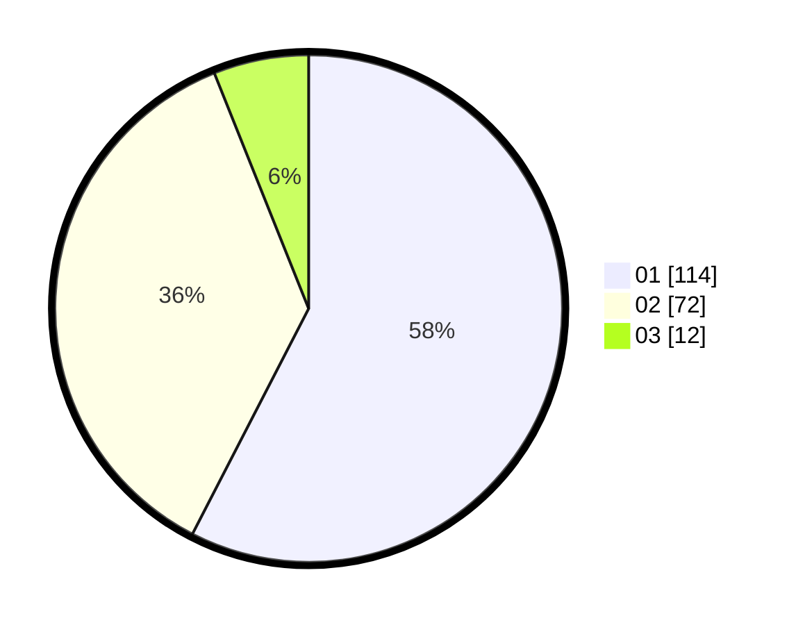

# Hasil

Hasil perolehan suara paslon dapat dilihat pada file paslon-01.txt, paslon-02.txt, dan paslon-03.txt.

Jika tidak ada, artinya data tersebut belum ada pada SIREKAP.

## Perolehan Suara

 * Paslon 01: **114**.
 * Paslon 02: **72**.
 * Paslon 03: **12**.

## Foto C Plano

https://sirekap-obj-formc.kpu.go.id/c55f/pemilu/ppwp/31/74/08/10/01/3174081001006-20240217-231106--d02c8457-3406-4aac-9bfb-1d83385a8b32.jpg

https://sirekap-obj-formc.kpu.go.id/c55f/pemilu/ppwp/31/74/08/10/01/3174081001006-20240217-232652--c68b9e7c-7b42-49ef-8b88-42a68602cce4.jpg

https://sirekap-obj-formc.kpu.go.id/c55f/pemilu/ppwp/31/74/08/10/01/3174081001006-20240217-232745--2486966d-96f5-4d0d-ad08-48bd26797f2e.jpg

## DATA PEMILIH TETAP

Jumlah pemilih dalam DPT: **274**.
 * L: **129**.
 * P: **145**.

## DATA PENGGUNA HAK PILIH

Jumlah pengguna hak pilih dalam DPT: **191**.
 * L: **83**.
 * P: **108**.

Jumlah pengguna hak pilih dalam DPTb: **17**.
 * L: **11**.
 * P: **6**.

Jumlah pengguna hak pilih dalam DPK: **1**.
 * L: **1**.
 * P: **0**.

Jumlah pengguna hak pilih: **209**.
 * L: **95**.
 * P: **114**.

## JUMLAH SUARA SAH DAN TIDAK SAH

JUMLAH SELURUH SUARA SAH: **198**.

JUMLAH SUARA TIDAK SAH: **11**.

JUMLAH SELURUH SUARA SAH DAN SUARA TIDAK SAH: **209**.
