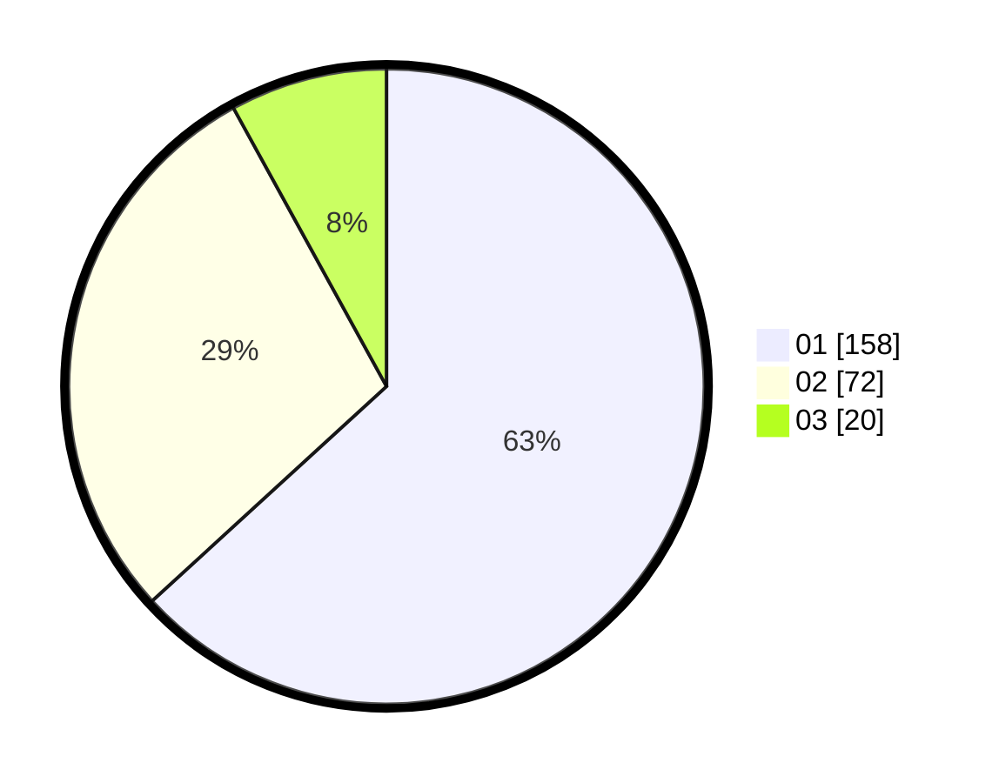

# Hasil

Hasil perolehan suara paslon dapat dilihat pada file paslon-01.txt, paslon-02.txt, dan paslon-03.txt.

Jika tidak ada, artinya data tersebut belum ada pada SIREKAP.

## Perolehan Suara

 * Paslon 01: **158**.
 * Paslon 02: **72**.
 * Paslon 03: **20**.

## Foto C Plano

https://sirekap-obj-formc.kpu.go.id/faf6/pemilu/ppwp/31/74/08/10/01/3174081001007-20240218-100059--8c519083-9916-45d1-9501-d49789ae8aae.jpg

https://sirekap-obj-formc.kpu.go.id/faf6/pemilu/ppwp/31/74/08/10/01/3174081001007-20240218-095647--8b314c07-57ec-42b1-b1b3-c631d5a58609.jpg

https://sirekap-obj-formc.kpu.go.id/faf6/pemilu/ppwp/31/74/08/10/01/3174081001007-20240218-100059--9c241827-8bcb-4d62-b2da-0b2137df2cd5.jpg

## DATA PEMILIH TETAP

Jumlah pemilih dalam DPT: **289**.
 * L: **147**.
 * P: **142**.

## DATA PENGGUNA HAK PILIH

Jumlah pengguna hak pilih dalam DPT: **239**.
 * L: **119**.
 * P: **120**.

Jumlah pengguna hak pilih dalam DPTb: **12**.
 * L: **4**.
 * P: **8**.

Jumlah pengguna hak pilih dalam DPK: **1**.
 * L: **0**.
 * P: **1**.

Jumlah pengguna hak pilih: **252**.
 * L: **123**.
 * P: **129**.

## JUMLAH SUARA SAH DAN TIDAK SAH

JUMLAH SELURUH SUARA SAH: **250**.

JUMLAH SUARA TIDAK SAH: **2**.

JUMLAH SELURUH SUARA SAH DAN SUARA TIDAK SAH: **252**.
