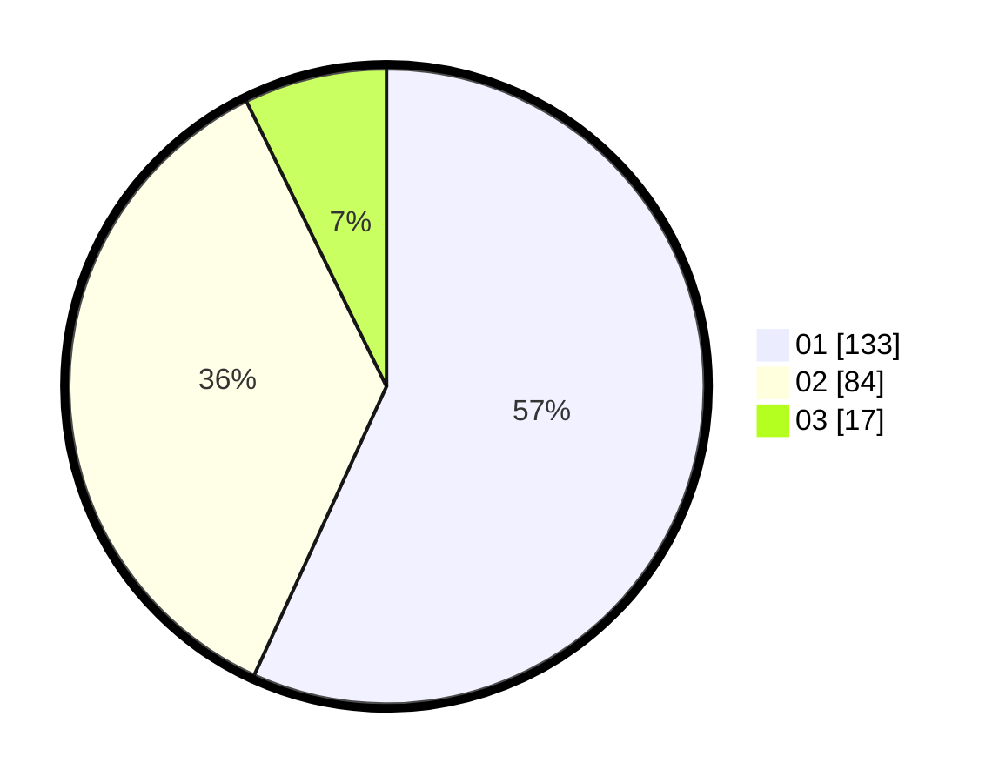

# Hasil

Hasil perolehan suara paslon dapat dilihat pada file paslon-01.txt, paslon-02.txt, dan paslon-03.txt.

Jika tidak ada, artinya data tersebut belum ada pada SIREKAP.

## Perolehan Suara

 * Paslon 01: **133**.
 * Paslon 02: **84**.
 * Paslon 03: **17**.

## Foto C Plano

https://sirekap-obj-formc.kpu.go.id/5399/pemilu/ppwp/31/74/08/10/01/3174081001013-20240218-102951--c840ab85-944b-45f3-a8a8-737c5d5fa197.jpg

https://sirekap-obj-formc.kpu.go.id/5399/pemilu/ppwp/31/74/08/10/01/3174081001013-20240218-103622--9e24aacc-fce9-4129-a2d9-706866389342.jpg

https://sirekap-obj-formc.kpu.go.id/5399/pemilu/ppwp/31/74/08/10/01/3174081001013-20240218-104638--c7d294e7-01bd-48e0-a48f-0ef4fa247295.jpg

## DATA PEMILIH TETAP

Jumlah pemilih dalam DPT: **230**.
 * L: **110**.
 * P: **120**.

## DATA PENGGUNA HAK PILIH

Jumlah pengguna hak pilih dalam DPT: **230**.
 * L: **110**.
 * P: **120**.

Jumlah pengguna hak pilih dalam DPTb: **7**.
 * L: **3**.
 * P: **4**.

Jumlah pengguna hak pilih dalam DPK: **1**.
 * L: **0**.
 * P: **1**.

Jumlah pengguna hak pilih: **238**.
 * L: **113**.
 * P: **125**.

## JUMLAH SUARA SAH DAN TIDAK SAH

JUMLAH SELURUH SUARA SAH: **234**.

JUMLAH SUARA TIDAK SAH: **4**.

JUMLAH SELURUH SUARA SAH DAN SUARA TIDAK SAH: **238**.
