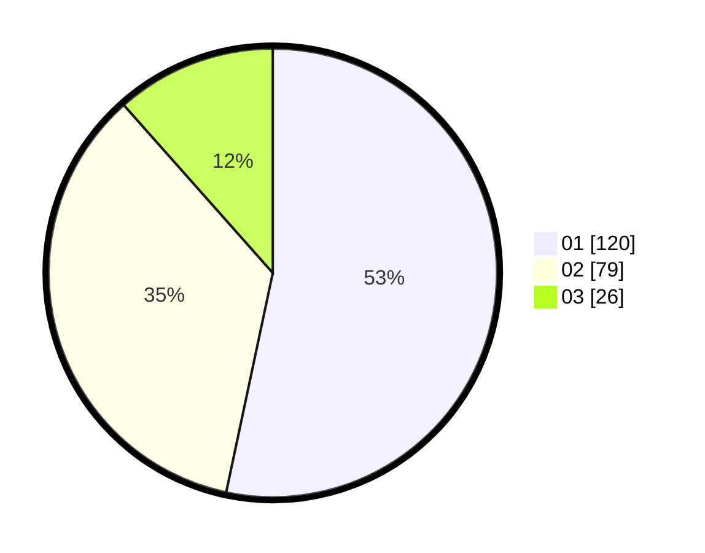

# Hasil

Hasil perolehan suara paslon dapat dilihat pada file paslon-01.txt, paslon-02.txt, dan paslon-03.txt.

Jika tidak ada, artinya data tersebut belum ada pada SIREKAP.

## Perolehan Suara

 * Paslon 01: **120**.
 * Paslon 02: **79**.
 * Paslon 03: **26**.

## Foto C Plano

https://sirekap-obj-formc.kpu.go.id/acfb/pemilu/ppwp/31/74/08/10/01/3174081001014-20240218-223601--660ad1ce-9862-42d7-95e3-44a6689ef4d6.jpg

https://sirekap-obj-formc.kpu.go.id/acfb/pemilu/ppwp/31/74/08/10/01/3174081001014-20240218-223900--f993d326-2cf2-4757-b997-121e8779e2ef.jpg

https://sirekap-obj-formc.kpu.go.id/acfb/pemilu/ppwp/31/74/08/10/01/3174081001014-20240218-222756--d29e4f51-a016-4819-97b7-59853d1e51eb.jpg

## DATA PEMILIH TETAP

Jumlah pemilih dalam DPT: **252**.
 * L: **122**.
 * P: **130**.

## DATA PENGGUNA HAK PILIH

Jumlah pengguna hak pilih dalam DPT: **216**.
 * L: **102**.
 * P: **114**.

Jumlah pengguna hak pilih dalam DPTb: **7**.
 * L: **4**.
 * P: **3**.

Jumlah pengguna hak pilih dalam DPK: **2**.
 * L: **1**.
 * P: **1**.

Jumlah pengguna hak pilih: **225**.
 * L: **107**.
 * P: **118**.

## JUMLAH SUARA SAH DAN TIDAK SAH

JUMLAH SELURUH SUARA SAH: **225**.

JUMLAH SUARA TIDAK SAH: **0**.

JUMLAH SELURUH SUARA SAH DAN SUARA TIDAK SAH: **225**.
