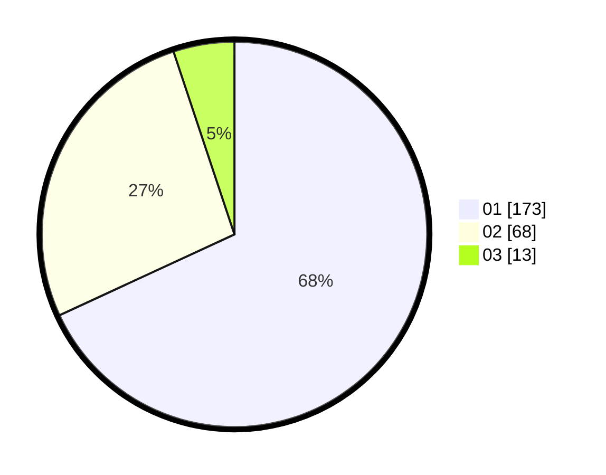

# Hasil

Hasil perolehan suara paslon dapat dilihat pada file paslon-01.txt, paslon-02.txt, dan paslon-03.txt.

Jika tidak ada, artinya data tersebut belum ada pada SIREKAP.

## Perolehan Suara

 * Paslon 01: **173**.
 * Paslon 02: **68**.
 * Paslon 03: **13**.

## Foto C Plano

https://sirekap-obj-formc.kpu.go.id/6b5e/pemilu/ppwp/31/74/08/10/01/3174081001015-20240217-171715--ebd83ad2-2a8c-4040-a4f6-698f67e10f85.jpg

https://sirekap-obj-formc.kpu.go.id/6b5e/pemilu/ppwp/31/74/08/10/01/3174081001015-20240218-120816--2416b36f-d307-4a66-9342-2e94345a1e51.jpg

https://sirekap-obj-formc.kpu.go.id/6b5e/pemilu/ppwp/31/74/08/10/01/3174081001015-20240217-172955--04eebe11-0654-4985-8667-a412e4295888.jpg

## DATA PEMILIH TETAP

Jumlah pemilih dalam DPT: **278**.
 * L: **136**.
 * P: **142**.

## DATA PENGGUNA HAK PILIH

Jumlah pengguna hak pilih dalam DPT: **238**.
 * L: **115**.
 * P: **123**.

Jumlah pengguna hak pilih dalam DPTb: **17**.
 * L: **9**.
 * P: **8**.

Jumlah pengguna hak pilih dalam DPK: **3**.
 * L: **0**.
 * P: **3**.

Jumlah pengguna hak pilih: **258**.
 * L: **124**.
 * P: **134**.

## JUMLAH SUARA SAH DAN TIDAK SAH

JUMLAH SELURUH SUARA SAH: **254**.

JUMLAH SUARA TIDAK SAH: **4**.

JUMLAH SELURUH SUARA SAH DAN SUARA TIDAK SAH: **258**.
