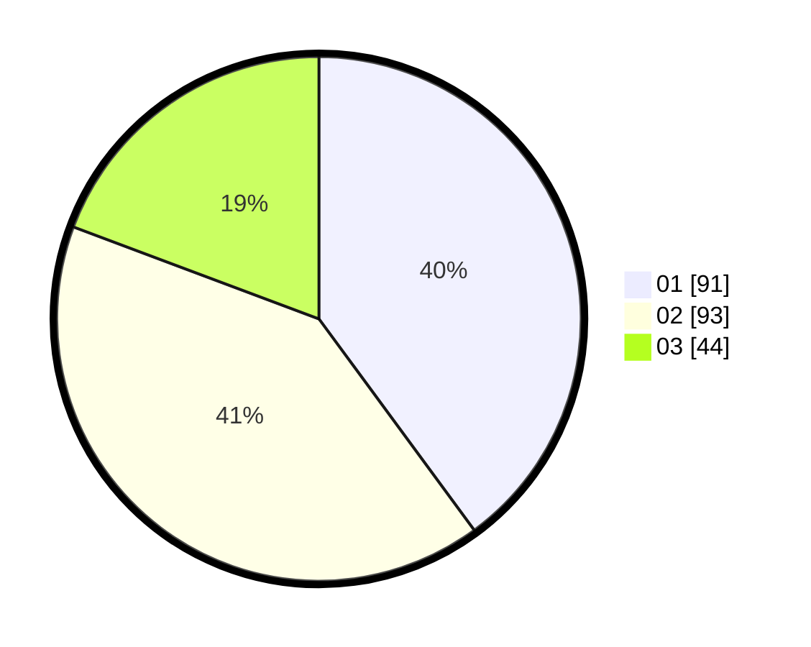

# Hasil

Hasil perolehan suara paslon dapat dilihat pada file paslon-01.txt, paslon-02.txt, dan paslon-03.txt.

Jika tidak ada, artinya data tersebut belum ada pada SIREKAP.

## Perolehan Suara

 * Paslon 01: **91**.
 * Paslon 02: **93**.
 * Paslon 03: **44**.

## Foto C Plano

https://sirekap-obj-formc.kpu.go.id/0af4/pemilu/ppwp/31/74/08/10/01/3174081001018-20240218-133557--01265804-91d9-46f2-a027-6cf58ad71ead.jpg

https://sirekap-obj-formc.kpu.go.id/0af4/pemilu/ppwp/31/74/08/10/01/3174081001018-20240218-134350--fe8a2b84-a2c7-4b4c-9f22-3997ecdc4998.jpg

https://sirekap-obj-formc.kpu.go.id/0af4/pemilu/ppwp/31/74/08/10/01/3174081001018-20240218-194342--3e82458f-19a5-4647-bfaa-f3a2ea2ecc04.jpg

## DATA PEMILIH TETAP

Jumlah pemilih dalam DPT: **277**.
 * L: **130**.
 * P: **147**.

## DATA PENGGUNA HAK PILIH

Jumlah pengguna hak pilih dalam DPT: **210**.
 * L: **98**.
 * P: **112**.

Jumlah pengguna hak pilih dalam DPTb: **18**.
 * L: **12**.
 * P: **6**.

Jumlah pengguna hak pilih dalam DPK: **3**.
 * L: **3**.
 * P: **0**.

Jumlah pengguna hak pilih: **231**.
 * L: **113**.
 * P: **118**.

## JUMLAH SUARA SAH DAN TIDAK SAH

JUMLAH SELURUH SUARA SAH: **228**.

JUMLAH SUARA TIDAK SAH: **3**.

JUMLAH SELURUH SUARA SAH DAN SUARA TIDAK SAH: **231**.
