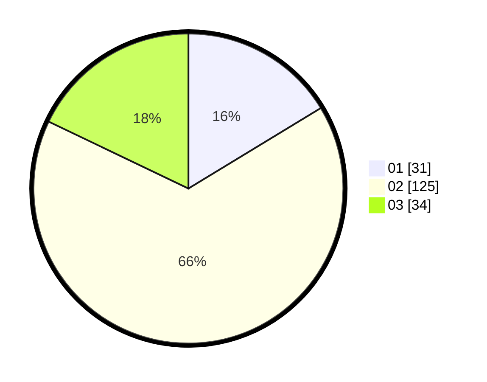

# Hasil

Hasil perolehan suara paslon dapat dilihat pada file paslon-01.txt, paslon-02.txt, dan paslon-03.txt.

Jika tidak ada, artinya data tersebut belum ada pada SIREKAP.

## Perolehan Suara

 * Paslon 01: **31**.
 * Paslon 02: **125**.
 * Paslon 03: **34**.

## Foto C Plano

https://sirekap-obj-formc.kpu.go.id/71b4/pemilu/ppwp/31/74/08/10/01/3174081001019-20240218-142741--f6b268d7-9d8a-43fe-b795-ed5863e80913.jpg

https://sirekap-obj-formc.kpu.go.id/71b4/pemilu/ppwp/31/74/08/10/01/3174081001019-20240218-142144--90dde33e-c52f-4a2f-9102-a3e2ef5d9ae7.jpg

https://sirekap-obj-formc.kpu.go.id/71b4/pemilu/ppwp/31/74/08/10/01/3174081001019-20240218-142815--a4a41298-e998-4110-b0f4-b57c0b1d4f67.jpg

## DATA PEMILIH TETAP

Jumlah pemilih dalam DPT: **264**.
 * L: **145**.
 * P: **119**.

## DATA PENGGUNA HAK PILIH

Jumlah pengguna hak pilih dalam DPT: **183**.
 * L: **98**.
 * P: **85**.

Jumlah pengguna hak pilih dalam DPTb: **13**.
 * L: **5**.
 * P: **8**.

Jumlah pengguna hak pilih dalam DPK: **0**.
 * L: **0**.
 * P: **0**.

Jumlah pengguna hak pilih: **196**.
 * L: **103**.
 * P: **93**.

## JUMLAH SUARA SAH DAN TIDAK SAH

JUMLAH SELURUH SUARA SAH: **191**.

JUMLAH SUARA TIDAK SAH: **5**.

JUMLAH SELURUH SUARA SAH DAN SUARA TIDAK SAH: **196**.
