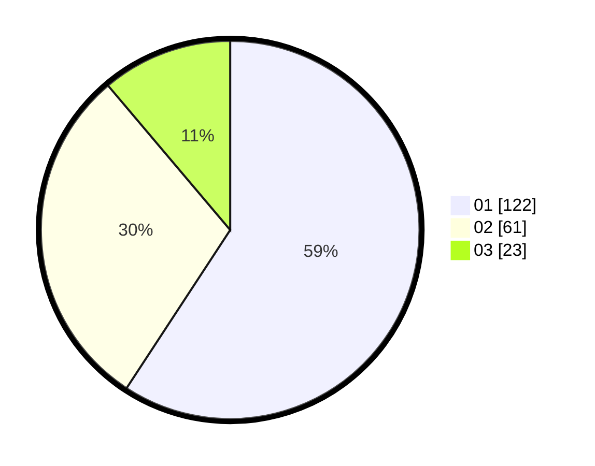

# Hasil

Hasil perolehan suara paslon dapat dilihat pada file paslon-01.txt, paslon-02.txt, dan paslon-03.txt.

Jika tidak ada, artinya data tersebut belum ada pada SIREKAP.

## Perolehan Suara

 * Paslon 01: **122**.
 * Paslon 02: **61**.
 * Paslon 03: **23**.

## Foto C Plano

https://sirekap-obj-formc.kpu.go.id/dd81/pemilu/ppwp/31/74/08/10/01/3174081001030-20240217-181319--f98fe418-95a1-494c-a37c-acb732aa7010.jpg

https://sirekap-obj-formc.kpu.go.id/dd81/pemilu/ppwp/31/74/08/10/01/3174081001030-20240217-184240--cdca6e9e-09f0-40ba-a0b2-9b90d094d1f3.jpg

https://sirekap-obj-formc.kpu.go.id/dd81/pemilu/ppwp/31/74/08/10/01/3174081001030-20240217-185037--288e0af7-8ef4-490c-9ddc-1b1df47f91f3.jpg

## DATA PEMILIH TETAP

Jumlah pemilih dalam DPT: **238**.
 * L: **116**.
 * P: **122**.

## DATA PENGGUNA HAK PILIH

Jumlah pengguna hak pilih dalam DPT: **199**.
 * L: **93**.
 * P: **106**.

Jumlah pengguna hak pilih dalam DPTb: **5**.
 * L: **0**.
 * P: **5**.

Jumlah pengguna hak pilih dalam DPK: **4**.
 * L: **2**.
 * P: **2**.

Jumlah pengguna hak pilih: **208**.
 * L: **95**.
 * P: **113**.

## JUMLAH SUARA SAH DAN TIDAK SAH

JUMLAH SELURUH SUARA SAH: **206**.

JUMLAH SUARA TIDAK SAH: **2**.

JUMLAH SELURUH SUARA SAH DAN SUARA TIDAK SAH: **208**.
