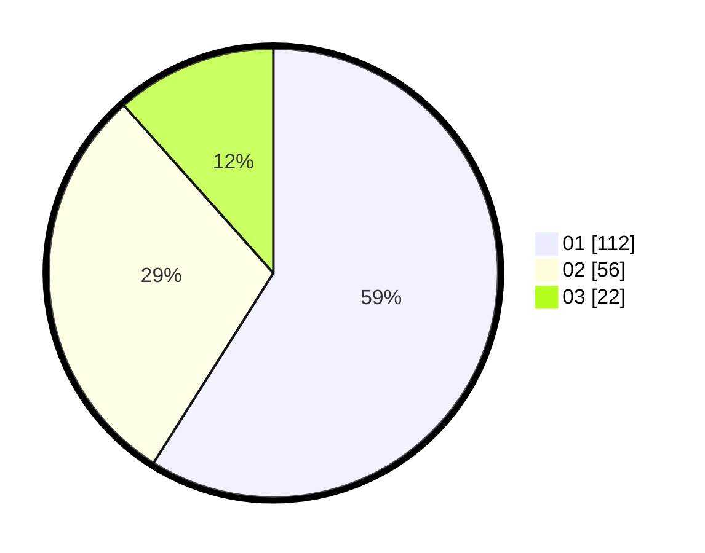

# Hasil

Hasil perolehan suara paslon dapat dilihat pada file paslon-01.txt, paslon-02.txt, dan paslon-03.txt.

Jika tidak ada, artinya data tersebut belum ada pada SIREKAP.

## Perolehan Suara

 * Paslon 01: **112**.
 * Paslon 02: **56**.
 * Paslon 03: **22**.

## Foto C Plano

https://sirekap-obj-formc.kpu.go.id/80fc/pemilu/ppwp/31/74/08/10/01/3174081001033-20240218-113104--b9404667-f319-46a5-b02f-d2cce2f4f079.jpg

https://sirekap-obj-formc.kpu.go.id/80fc/pemilu/ppwp/31/74/08/10/01/3174081001033-20240218-113839--17b2df9d-4d9b-44e6-bac6-d365f33a826d.jpg

https://sirekap-obj-formc.kpu.go.id/80fc/pemilu/ppwp/31/74/08/10/01/3174081001033-20240218-115830--7a54c0a1-7f59-4afd-809f-b6c20f5c0bf5.jpg

## DATA PEMILIH TETAP

Jumlah pemilih dalam DPT: **251**.
 * L: **131**.
 * P: **120**.

## DATA PENGGUNA HAK PILIH

Jumlah pengguna hak pilih dalam DPT: **193**.
 * L: **94**.
 * P: **99**.

Jumlah pengguna hak pilih dalam DPTb: **2**.
 * L: **0**.
 * P: **2**.

Jumlah pengguna hak pilih dalam DPK: **0**.
 * L: **0**.
 * P: **0**.

Jumlah pengguna hak pilih: **195**.
 * L: **94**.
 * P: **101**.

## JUMLAH SUARA SAH DAN TIDAK SAH

JUMLAH SELURUH SUARA SAH: **190**.

JUMLAH SUARA TIDAK SAH: **5**.

JUMLAH SELURUH SUARA SAH DAN SUARA TIDAK SAH: **195**.
