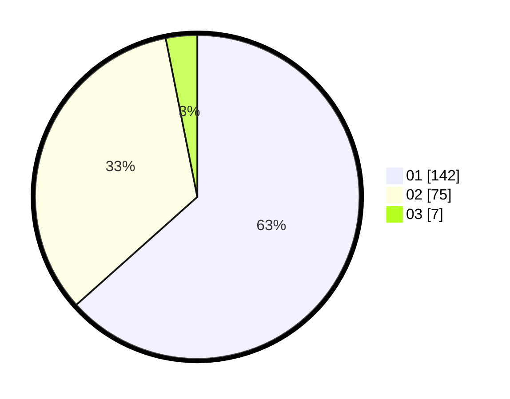

# Hasil

Hasil perolehan suara paslon dapat dilihat pada file paslon-01.txt, paslon-02.txt, dan paslon-03.txt.

Jika tidak ada, artinya data tersebut belum ada pada SIREKAP.

## Perolehan Suara

 * Paslon 01: **142**.
 * Paslon 02: **75**.
 * Paslon 03: **7**.

## Foto C Plano

https://sirekap-obj-formc.kpu.go.id/a82d/pemilu/ppwp/31/74/08/10/01/3174081001037-20240218-001946--feecfd67-740d-465b-9ad1-1f98de4d7c02.jpg

https://sirekap-obj-formc.kpu.go.id/a82d/pemilu/ppwp/31/74/08/10/01/3174081001037-20240217-210221--01df859f-6f01-44d6-a60e-9fdb70e158ea.jpg

https://sirekap-obj-formc.kpu.go.id/a82d/pemilu/ppwp/31/74/08/10/01/3174081001037-20240217-221113--0dc74abd-5fbc-4056-b26a-6816be253616.jpg

## DATA PEMILIH TETAP

Jumlah pemilih dalam DPT: **262**.
 * L: **132**.
 * P: **130**.

## DATA PENGGUNA HAK PILIH

Jumlah pengguna hak pilih dalam DPT: **222**.
 * L: **110**.
 * P: **112**.

Jumlah pengguna hak pilih dalam DPTb: **1**.
 * L: **0**.
 * P: **1**.

Jumlah pengguna hak pilih dalam DPK: **3**.
 * L: **2**.
 * P: **1**.

Jumlah pengguna hak pilih: **226**.
 * L: **112**.
 * P: **114**.

## JUMLAH SUARA SAH DAN TIDAK SAH

JUMLAH SELURUH SUARA SAH: **224**.

JUMLAH SUARA TIDAK SAH: **2**.

JUMLAH SELURUH SUARA SAH DAN SUARA TIDAK SAH: **226**.
