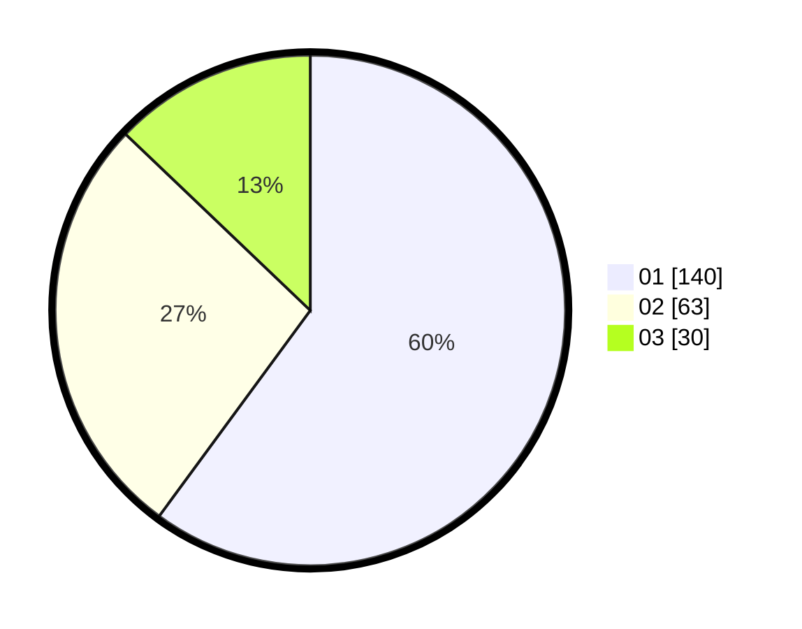

# Hasil

Hasil perolehan suara paslon dapat dilihat pada file paslon-01.txt, paslon-02.txt, dan paslon-03.txt.

Jika tidak ada, artinya data tersebut belum ada pada SIREKAP.

## Perolehan Suara

 * Paslon 01: **140**.
 * Paslon 02: **63**.
 * Paslon 03: **30**.

## Foto C Plano

https://sirekap-obj-formc.kpu.go.id/8846/pemilu/ppwp/31/74/08/10/01/3174081001038-20240218-175935--aab3f596-6402-420a-abf4-ae49d26c2c95.jpg

https://sirekap-obj-formc.kpu.go.id/8846/pemilu/ppwp/31/74/08/10/01/3174081001038-20240218-114710--263e3723-ce26-4298-9b82-f65e9e52c6b6.jpg

https://sirekap-obj-formc.kpu.go.id/8846/pemilu/ppwp/31/74/08/10/01/3174081001038-20240218-175936--c958e859-bc75-4f8a-b714-97b6fa230117.jpg

## DATA PEMILIH TETAP

Jumlah pemilih dalam DPT: **232**.
 * L: **115**.
 * P: **117**.

## DATA PENGGUNA HAK PILIH

Jumlah pengguna hak pilih dalam DPT: **232**.
 * L: **115**.
 * P: **117**.

Jumlah pengguna hak pilih dalam DPTb: **0**.
 * L: **0**.
 * P: **0**.

Jumlah pengguna hak pilih dalam DPK: **4**.
 * L: **2**.
 * P: **2**.

Jumlah pengguna hak pilih: **236**.
 * L: **117**.
 * P: **119**.

## JUMLAH SUARA SAH DAN TIDAK SAH

JUMLAH SELURUH SUARA SAH: **233**.

JUMLAH SUARA TIDAK SAH: **3**.

JUMLAH SELURUH SUARA SAH DAN SUARA TIDAK SAH: **236**.
