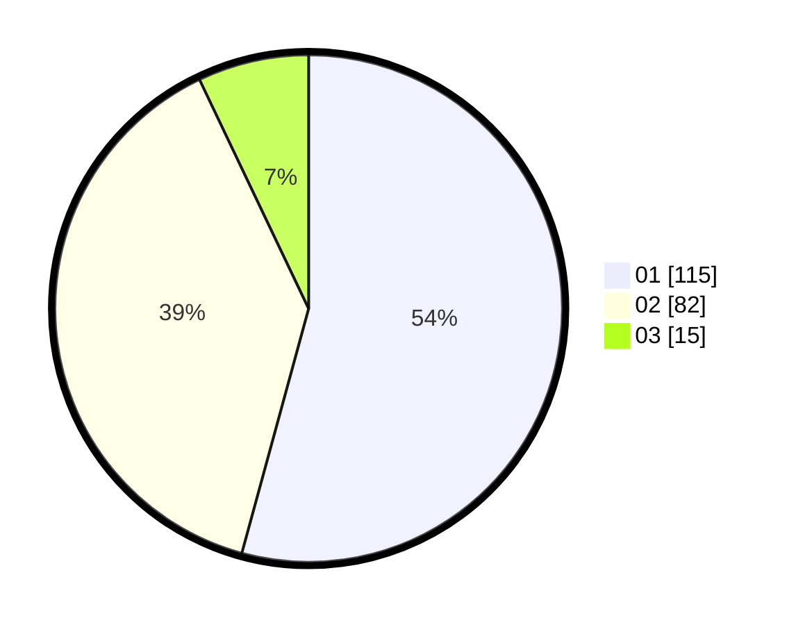

# Hasil

Hasil perolehan suara paslon dapat dilihat pada file paslon-01.txt, paslon-02.txt, dan paslon-03.txt.

Jika tidak ada, artinya data tersebut belum ada pada SIREKAP.

## Perolehan Suara

 * Paslon 01: **115**.
 * Paslon 02: **82**.
 * Paslon 03: **15**.

## Foto C Plano

https://sirekap-obj-formc.kpu.go.id/39e3/pemilu/ppwp/31/74/08/10/01/3174081001039-20240217-212328--4d8f6996-e913-472c-9066-34d5707e606d.jpg

https://sirekap-obj-formc.kpu.go.id/39e3/pemilu/ppwp/31/74/08/10/01/3174081001039-20240217-213019--7052a563-5a0c-4183-b380-4726597247ad.jpg

https://sirekap-obj-formc.kpu.go.id/39e3/pemilu/ppwp/31/74/08/10/01/3174081001039-20240217-213303--cec02552-23d8-42fd-9bfa-58cb5a0048b3.jpg

## DATA PEMILIH TETAP

Jumlah pemilih dalam DPT: **256**.
 * L: **123**.
 * P: **133**.

## DATA PENGGUNA HAK PILIH

Jumlah pengguna hak pilih dalam DPT: **256**.
 * L: **123**.
 * P: **133**.

Jumlah pengguna hak pilih dalam DPTb: **8**.
 * L: **6**.
 * P: **2**.

Jumlah pengguna hak pilih dalam DPK: **2**.
 * L: **0**.
 * P: **2**.

Jumlah pengguna hak pilih: **266**.
 * L: **129**.
 * P: **137**.

## JUMLAH SUARA SAH DAN TIDAK SAH

JUMLAH SELURUH SUARA SAH: **212**.

JUMLAH SUARA TIDAK SAH: **5**.

JUMLAH SELURUH SUARA SAH DAN SUARA TIDAK SAH: **217**.
