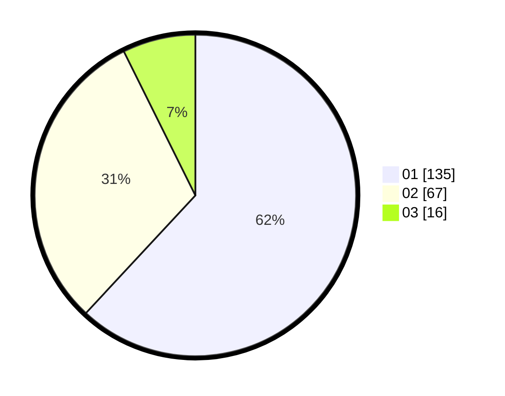

# Hasil

Hasil perolehan suara paslon dapat dilihat pada file paslon-01.txt, paslon-02.txt, dan paslon-03.txt.

Jika tidak ada, artinya data tersebut belum ada pada SIREKAP.

## Perolehan Suara

 * Paslon 01: **135**.
 * Paslon 02: **67**.
 * Paslon 03: **16**.

## Foto C Plano

https://sirekap-obj-formc.kpu.go.id/9f31/pemilu/ppwp/31/74/08/10/01/3174081001041-20240217-212835--95f5820e-0680-4d56-988e-4673688838db.jpg

https://sirekap-obj-formc.kpu.go.id/9f31/pemilu/ppwp/31/74/08/10/01/3174081001041-20240217-214224--5ebcb600-e29d-484e-8303-4d183b3be08e.jpg

https://sirekap-obj-formc.kpu.go.id/9f31/pemilu/ppwp/31/74/08/10/01/3174081001041-20240217-214727--d298d854-50db-460f-8ae3-02d7e7ce3d2c.jpg

## DATA PEMILIH TETAP

Jumlah pemilih dalam DPT: **256**.
 * L: **133**.
 * P: **123**.

## DATA PENGGUNA HAK PILIH

Jumlah pengguna hak pilih dalam DPT: **214**.
 * L: **104**.
 * P: **110**.

Jumlah pengguna hak pilih dalam DPTb: **3**.
 * L: **1**.
 * P: **2**.

Jumlah pengguna hak pilih dalam DPK: **2**.
 * L: **0**.
 * P: **2**.

Jumlah pengguna hak pilih: **219**.
 * L: **105**.
 * P: **114**.

## JUMLAH SUARA SAH DAN TIDAK SAH

JUMLAH SELURUH SUARA SAH: **218**.

JUMLAH SUARA TIDAK SAH: **1**.

JUMLAH SELURUH SUARA SAH DAN SUARA TIDAK SAH: **219**.
