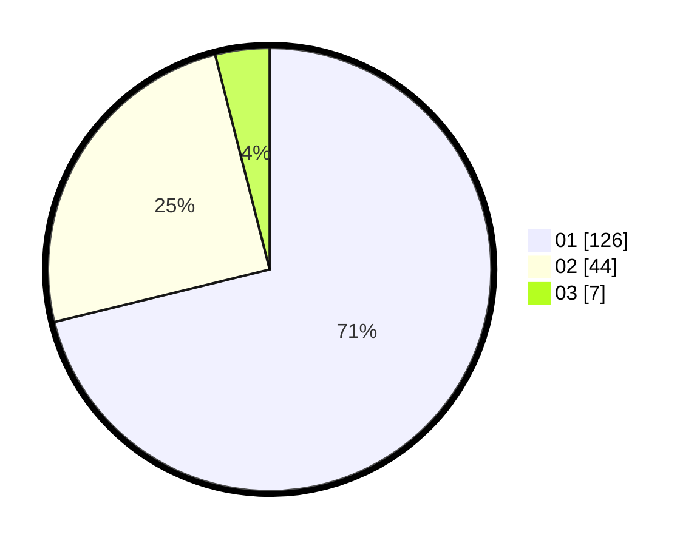

# Hasil

Hasil perolehan suara paslon dapat dilihat pada file paslon-01.txt, paslon-02.txt, dan paslon-03.txt.

Jika tidak ada, artinya data tersebut belum ada pada SIREKAP.

## Perolehan Suara

 * Paslon 01: **126**.
 * Paslon 02: **44**.
 * Paslon 03: **7**.

## Foto C Plano

https://sirekap-obj-formc.kpu.go.id/5640/pemilu/ppwp/31/74/08/10/01/3174081001043-20240217-152936--7b13309b-62f4-4c1f-a7fe-0e01628b3c6d.jpg

https://sirekap-obj-formc.kpu.go.id/5640/pemilu/ppwp/31/74/08/10/01/3174081001043-20240217-153042--df8e7ff3-cf24-4d61-8d8c-9ea41a9c8ddf.jpg

https://sirekap-obj-formc.kpu.go.id/5640/pemilu/ppwp/31/74/08/10/01/3174081001043-20240217-153141--adb8534e-56d2-4220-acca-5deb81bd480b.jpg

## DATA PEMILIH TETAP

Jumlah pemilih dalam DPT: **214**.
 * L: **107**.
 * P: **107**.

## DATA PENGGUNA HAK PILIH

Jumlah pengguna hak pilih dalam DPT: **180**.
 * L: **89**.
 * P: **91**.

Jumlah pengguna hak pilih dalam DPTb: **1**.
 * L: **0**.
 * P: **1**.

Jumlah pengguna hak pilih dalam DPK: **0**.
 * L: **0**.
 * P: **0**.

Jumlah pengguna hak pilih: **181**.
 * L: **89**.
 * P: **92**.

## JUMLAH SUARA SAH DAN TIDAK SAH

JUMLAH SELURUH SUARA SAH: **177**.

JUMLAH SUARA TIDAK SAH: **4**.

JUMLAH SELURUH SUARA SAH DAN SUARA TIDAK SAH: **181**.
