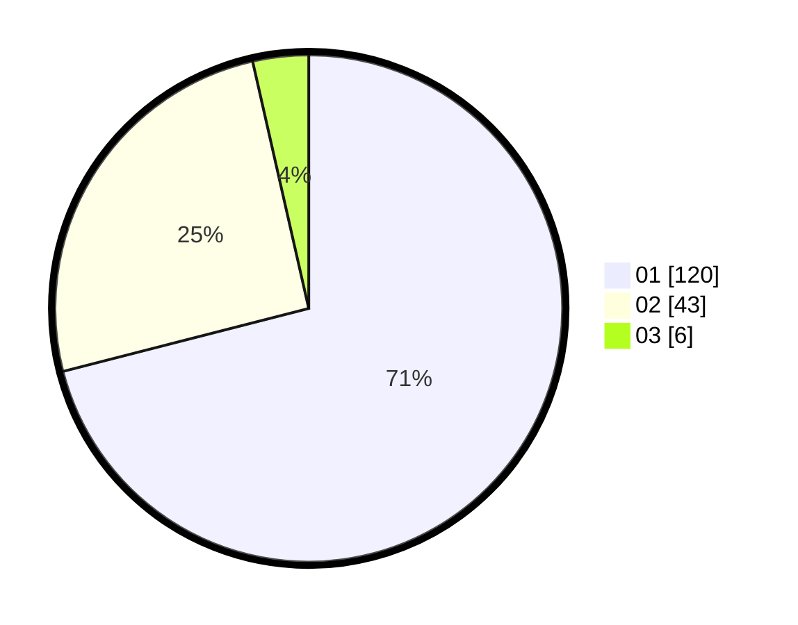

# Hasil

Hasil perolehan suara paslon dapat dilihat pada file paslon-01.txt, paslon-02.txt, dan paslon-03.txt.

Jika tidak ada, artinya data tersebut belum ada pada SIREKAP.

## Perolehan Suara

 * Paslon 01: **120**.
 * Paslon 02: **43**.
 * Paslon 03: **6**.

## Foto C Plano

https://sirekap-obj-formc.kpu.go.id/5899/pemilu/ppwp/31/74/08/10/01/3174081001044-20240218-141326--e218649a-5c74-4886-9b68-0ba6db461d91.jpg

https://sirekap-obj-formc.kpu.go.id/5899/pemilu/ppwp/31/74/08/10/01/3174081001044-20240218-141606--f57f78ea-e503-4108-bb3d-7e15803ed3f2.jpg

https://sirekap-obj-formc.kpu.go.id/5899/pemilu/ppwp/31/74/08/10/01/3174081001044-20240218-141814--ae9c59d2-8512-4d45-8376-338946ac0a37.jpg

## DATA PEMILIH TETAP

Jumlah pemilih dalam DPT: **172**.
 * L: **87**.
 * P: **85**.

## DATA PENGGUNA HAK PILIH

Jumlah pengguna hak pilih dalam DPT: **172**.
 * L: **87**.
 * P: **85**.

Jumlah pengguna hak pilih dalam DPTb: **0**.
 * L: **0**.
 * P: **0**.

Jumlah pengguna hak pilih dalam DPK: **3**.
 * L: **1**.
 * P: **2**.

Jumlah pengguna hak pilih: **175**.
 * L: **88**.
 * P: **87**.

## JUMLAH SUARA SAH DAN TIDAK SAH

JUMLAH SELURUH SUARA SAH: **169**.

JUMLAH SUARA TIDAK SAH: **6**.

JUMLAH SELURUH SUARA SAH DAN SUARA TIDAK SAH: **175**.
