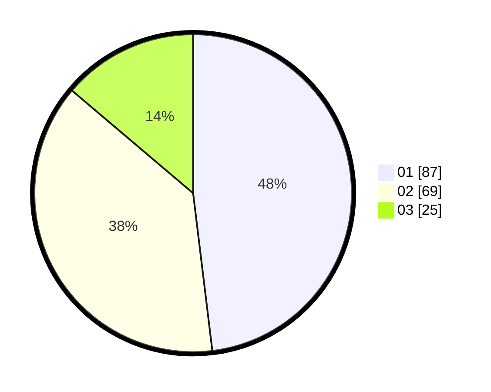

# Hasil

Hasil perolehan suara paslon dapat dilihat pada file paslon-01.txt, paslon-02.txt, dan paslon-03.txt.

Jika tidak ada, artinya data tersebut belum ada pada SIREKAP.

## Perolehan Suara

 * Paslon 01: **87**.
 * Paslon 02: **69**.
 * Paslon 03: **25**.

## Foto C Plano

https://sirekap-obj-formc.kpu.go.id/9342/pemilu/ppwp/31/74/08/10/01/3174081001047-20240217-213808--71cdeae8-d009-425e-939b-705e26e2254d.jpg

https://sirekap-obj-formc.kpu.go.id/9342/pemilu/ppwp/31/74/08/10/01/3174081001047-20240217-214842--43982e4d-dca7-492e-b03f-d28a9aae6b45.jpg

https://sirekap-obj-formc.kpu.go.id/9342/pemilu/ppwp/31/74/08/10/01/3174081001047-20240217-215230--2fe3ae05-ca59-429a-9ffa-9f766f3817bb.jpg

## DATA PEMILIH TETAP

Jumlah pemilih dalam DPT: **223**.
 * L: **85**.
 * P: **138**.

## DATA PENGGUNA HAK PILIH

Jumlah pengguna hak pilih dalam DPT: **168**.
 * L: **79**.
 * P: **89**.

Jumlah pengguna hak pilih dalam DPTb: **7**.
 * L: **4**.
 * P: **3**.

Jumlah pengguna hak pilih dalam DPK: **8**.
 * L: **7**.
 * P: **1**.

Jumlah pengguna hak pilih: **183**.
 * L: **90**.
 * P: **93**.

## JUMLAH SUARA SAH DAN TIDAK SAH

JUMLAH SELURUH SUARA SAH: **181**.

JUMLAH SUARA TIDAK SAH: **2**.

JUMLAH SELURUH SUARA SAH DAN SUARA TIDAK SAH: **183**.
